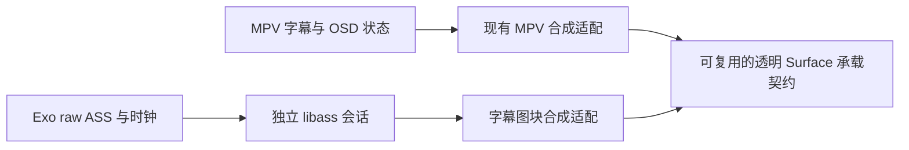
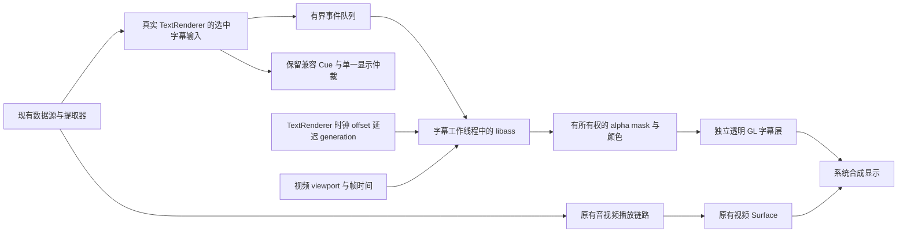

# E4-LIBASS：Exo ASS 特效字幕方案与最佳实践评审

## Recovery anchor

- 目标：回答 WebHTV 能否独立接入完整 ASS/SSA 特效渲染，并给出成熟开源参考、推荐设计、可验证边界、分阶段实施与回滚方案。
- 授权：2026-09-14 用户要求复评本方案、参考成熟开源实现并结合实际代码完善；本轮仅评估和改文档，不改生产代码、依赖、补丁或二进制。
- Lane/scope：assessment；仅本文件和 `docs/upstream-player-dependency-merge-assessment-2026-08-20.md`。首轮证据在 `/private/tmp/webhtv-libass-research-20260914/`，复评新增证据在 `/private/tmp/webhtv-libass-review-20260914/`。
- 分支/复评基线：`feature/mpv-dv7-fel` / `bc2b3b284de87ada937b4ba3564f6fb12aa8a956`，即首轮方案归档提交。首轮代码基线为 `4a447f26e5fa488cb0c1c661398e374b10a56b6e`。
- 保护：开始时仅 `app/.cxx/` 未跟踪，70 个文件由 guard 保护，不纳入本任务。
- 稳定 ID：`E4-LIBASS`；历史 `E4-2` 是 Cue layer/collision/margin 适配，不重编号、不将其冒充 libass 接入。
- 进度：复评方案已落盘。以实际发布的 Media3 sources JAR 补核了外挂输入、Matroska 封装、字幕延迟、RendererHolder 和宿主生命周期。推荐保留真实 TextRenderer，增加默认无操作的窄观察接口，复用 SurfaceView 承载契约，独立持有 Exo libass/GL 会话；不在首阶段抽取 MPV 公共 native 模块。所有实施阶段仍未批准。
- 最便宜的决定性验证：逐项核对原始源码/测试、官方契约、维护者 issue 与独立实现；不把 README 宣传、编译或 MPV 行为当作 WebHTV Exo 的运行证据。
- 本次时间目标：上海时间 2026-09-14 17:38–18:13；本地复核 8 分钟、开源证据 15 分钟、文档 10 分钟、校验归档 2 分钟。复用了同日已固定的研究快照，只补查能改变设计的事实。
- 网络：系统 HTTP/HTTPS 代理为 `http://127.0.0.1:7897`；后续网络取证显式使用该代理。初次 GitHub 发现查询在代理识别前直连成功，单独记录。
- 回滚：撤销本次文档提交即可恢复首轮方案；生产代码保持复评基线。
- 当前变更：本方案及索引的一行状态；无生产代码修改。文档校验和归档结果由 `Task-Guard: E4-LIBASS-review` 提交的 `Verification` 与 `recovery/E4-LIBASS-review/` 本地 tag 记录，不把方案建议标记为运行验证。
- 未决风险：WebHTV 双 ABI 实机性能、HDR/DV 合成、复杂字体附件及连续 seek 的行为仍需将来经批准的原型验证；未执行构建、安装或性能测试。
- 唯一下一步：用户决定是否批准第 8 节修订后的阶段 1；批准后按该阶段建立包含 Media3 窄接口、独立 JNI 和 App 接线的实施 scope。

## 研究问题与证据标准

1. 是否已有可复用、维护中的 Media3/libass 扩展，而非仅编译脚本或演示？
2. 如何保留 ASS 原始事件、头部、字体附件和时间轴，避免普通 Cue 转换丢失动画/卡拉 OK 信息？
3. 时钟、seek/flush、选轨、暂停/倍速、字体、渲染线程和 Surface 生命周期应如何分工？
4. CPU 位图叠加、GPU 合成、WASM/WebView 或视频烧录各有什么实际限制？
5. 当前 WebHTV 的本地 Media3 补丁、网络/预加载、HDR/DV、双 ABI 与现有字幕行为如何保留？

证据分类：A=源码/测试/官方契约；B=维护者解释或成熟项目实践；C=有方法的独立技术报告；D=单篇帖子或未经复现的经验。论文与宣传性性能数据不会直接转化为本项目性能保证。

## 1. 结论与建议

**可以自行实现，推荐复用成熟的 libass 排版/特效内核，自行完成 Exo 接入和呈现适配。** 不必等待 Media3 官方合并 libass，也不必重新发明 ASS 解释器。

目标是让 Exo 播放时支持字幕组常见的定位、移动、变换、卡拉 OK、描边/阴影/模糊、矢量绘图、裁剪、分层及嵌入字体。这里的“完整特效”以选定 libass 版本及测试语料为基准，不能扩大为全部 VSFilter 历史行为、所有字体格式或所有电视均完全一致。

最直接的开源起点是 **peerless2012/libass-android**；最有价值的实际消费者是 **Jellyfin Android TV**；跨平台设计参照是 **GStreamer、VLC、Kodi、JASSUB**。这组证据能支撑可行性和设计选择，不能代替 WebHTV 的性能及 HDR/DV 实机验收。

建议批准时只先实施阶段 1：默认关闭的外挂 ASS 原型，验证 libass、字体、复用既有承载方式的透明层、准确时钟及兼容字幕回退。复评将接入方式收敛为“保留真实 TextRenderer + 本地窄观察接口”，见 6.1；代价是首阶段需要重建受影响的 Media3 Java 产物，而不只是加 App 类。对于视频为 SurfaceView 的路线，优先复用现有字幕 SurfaceView 的承载契约。其余阶段逐阶段批准，不自动进入 MKV 提取器或生产默认行为修改。

### 1.1 复评发现及决策变化

原方案的 libass 内核、独立叠加层和分阶段方向成立，但以下缺口必须补齐，才能据此实施。

| 优先级 | 已核实的缺口 | 本次决定 |
| --- | --- | --- |
| P1，编码前 | 实际 Media3 默认不在提取阶段解析外挂字幕；只注入 parser factory 可能完全不走预期路径 | 从当前选中的 TextRenderer 输入接入；不全局翻转字幕解析模式，见 2.2、6.1 |
| P1，编码前 | raw ASS 带合成 Dialogue 前缀；原始 BlockDuration 已被写成百分之一秒，不能冒充原始 MKV chunk | 外挂完整文件、Media3 封装事件、原生 MKV 事件三种输入显式区分；精确 MKV 输入留给阶段 2 |
| P1，编码前 | NoSampleRenderer 不接收文本延迟消息；包装 TextRenderer 会绕开 RendererHolder 的类型特判 | 保留 TextRenderer 实例及其原状态机，在实际 offset/延迟已知的位置输出观察数据 |
| P1，原型验收 | 无操作 parser、隐藏 Cue 和“异常时回退”之间缺少可执行的恢复路径 | 保留兼容 Cue、保存当前有效输出，成功接管才抑制重复显示；输入超限或原生层可返回失败时恢复，见 6.4 |
| P1，MKV 验收 | “seek 后重放长事件”不是缓存自然能保证的能力，尤其首次跳到未读区间 | 明确已缓存/未缓存两类；缺少覆盖证明时不声称完整支持，见 6.2 |
| P2，产品化前 | 色彩矩阵、晚到字体、API 24 与现有 CMake API 26 差异、实际图像基准还不够具体 | 补 libass 官方契约和回归语料；基础 native 门槛前移至首次构建，见 6.3、9、11 |

这些是对方案和接口的审查结论，不是已复现的 WebHTV 故障，也不是对开源项目整体质量的评价。

## 2. 当前 WebHTV 的实际基础

| 已有能力与落点 | 对本次设计的约束 |
| --- | --- |
| [ExoUtil.java](../app/src/main/java/com/fongmi/android/tv/player/exo/ExoUtil.java) `setPlayerView`：启用 embedded styles，但关闭 embedded font sizes；已有用户字幕位置/字号设置 | 普通字幕继续沿用原行为；ASS 原样模式必须明确用户字号/位置覆盖规则，不能无条件破坏脚本坐标 |
| 同文件 `buildPlayer`、`buildRenderersFactory`：自定义 `FfmpegRenderersFactory`、软解/硬解选择、音频输出和动态调度 | 只能装饰既有工厂；不能换成扩展示例中的默认播放器工厂 |
| 同文件约 212 行已注册 `PlaybackAnalyticsListener` 为 `VideoFrameMetadataListener`；[PlaybackAnalyticsListener.java](../app/src/main/java/com/fongmi/android/tv/player/exo/PlaybackAnalyticsListener.java) `onVideoFrameAboutToBeRendered` 更新帧率、帧调度/seek 诊断 | 如使用帧时间做字幕同步，应共享分发并保留原监听者；再次直接 `setVideoFrameMetadataListener` 会覆盖既有接线 |
| [MediaSourceFactory.java](../app/src/main/java/com/fongmi/android/tv/player/exo/MediaSourceFactory.java) `createUpstreamDataSourceFactory`、`getExtractorsFactory`、`createMediaSource` | 保留 OkHttp 请求头、EOF 恢复、预加载优先级、缓存、APE、拼接播放及仅加载选中轨道策略；外挂字幕也走现有数据源契约 |
| [DolbyVisionP81ExtractorsFactory.java](../app/src/main/java/com/fongmi/android/tv/player/exo/DolbyVisionP81ExtractorsFactory.java) `wrap`：Matroska raw subtitle、远程 deferred Cues、DV7/P8.1 参数和视频包装 | 直接替换为第三方 `AssMatroskaExtractor` 可能丢失这些参数和后续视频适配；应在现有链路加最小输入钩子 |
| 锁定的 Media3 `SsaParser` 及 `SsaParserTest` 已有样式、位置、layer、重叠与字体样式测试；历史 E4-2 为 layer/collision/margin 适配 | 当前不是“完全不支持 ASS 样式”；缺口是完整运行时特效、字体与帧呈现。不能把 E4-2 重新包装成新任务 |
| MPV 的独立 native 链已经带 libass 与字体库 | 可用作视觉参考；不能从 `libmpv.so` 内部借私有符号/JNI 给 Exo，不能把 MPV 播放成功当作 Exo 验证 |

本地版本依据：[media-lock.json](../third_party/media-lock.json) 的 Media3 `1.11.0-alpha01-fongmi`，源码提交 `e3e922d5c01bc0b564849940fe589daf37360d15`；nextlib `1.10.0-0.12.1-fongmi-softload-av3a-ffmpeg901-r3`，提交 `6ff6cf9d0820382b3c233d018c52e4163b09d345`。**Media3 实际产物还叠加 lock 中的补丁和 artifact overrides，不能仅凭裸提交判断发布行为。** 首轮读 Git 对象；复评进一步读取本地 Maven sources JAR，核得 exoplayer SHA-256 `83f4f83b4f44e621d52002c161f63fbcb77be6856af4b1e4a4cb0982b04549e1`、extractor SHA-256 `ec22c28c9fef1f4fdb54b495da919a706d4a28b781ac6701790a259beee6dedd`，均与 lock 一致。此处是源码身份核验，没有重新编译或验证二进制运行行为。

`/Users/macbookpro/Desktop/github/media` 的当前 checkout 是 `3c2cbe8ac742c2fe15eff52f03eeb3b1b648848d`，不能与锁定产物混为一谈。锁定源码也确认存在 `NoSampleRenderer.onRendererOffsetChanged(offsetUs)` 和 `onPositionReset(...)`；前者契约明确规定从 renderer position 减去 offset 得到媒体位置。实现时仍需对实际依赖进行编译验证。

### 2.1 用户补充：已有 MPV 字幕 SurfaceView 能否给 Exo 复用

**可以复用显示承载和部分合成实现；目前它还不是一个任意播放器可直接调用的完整 ASS 服务。** 初稿只提独立层，没有充分纳入本地已实现的这部分，现修正推荐优先级。

核验到的真实链路：

1. [MpvPlayer.java](../app/src/main/java/androidx/media3/mpvplayer/MpvPlayer.java) 约 2827 行 `createOsdSurfaceView()` 创建普通 `SurfaceView`，设置 `setZOrderMediaOverlay(true)`、`PixelFormat.TRANSLUCENT`、不接收焦点/点击，并放到视频 SurfaceView 的同一父容器。它依赖 `requiresOsdSurface()` 的 direct-output/ISO 条件，并非所有 MPV 输出都走此层。
2. `osdSurfaceCallback`、`reconcileOsdSurface()` 管理尺寸与挂接；[MPVLib.java](../app/src/main/java/is/xyz/mpv/MPVLib.java) 的 `enqueueOsdSurface` 经 [render.cpp](../third_party/mpv-player-jni/src/render.cpp) 和 [request.cpp](../third_party/mpv-player-jni/src/request.cpp) 设置 MPV 的 `android-osd-wid`。JNI 明确要求 MPV 已初始化，没有“提交 ASS_Image 给任意 Surface”的接口。
3. 固定 MPV 源码 `video/out/vo_mediacodec_embed.c` 在 `draw_frame` 用视频 PTS 调 `android_osd_overlay_render`，在 `flip_page` 呈现 OSD；本地另有 optional-OSD/timed-release 补丁，不能把裸源码的前置条件当成当前成品所有行为。
4. `video/out/android_osd_overlay.c` 已实现 `ANativeWindow`、RGBA EGL window surface、GLES2 shader、预乘 alpha 混合、纹理上传、change-id 缓存、清屏与释放。其 `android_osd_overlay_render()` 调用的是 `osd_render(ctx->vo->osd, ...)`，只请求 `SUBBITMAP_BGRA`，然后上传 MPV 打包后的彩色字幕图块。

| 现有部分 | 复用判断 | 必须保留/补上的边界 |
| --- | --- | --- |
| 透明 SurfaceView 创建、层级、尺寸、非交互属性 | 可提取最小通用承载逻辑，Exo/MPV 分别使用 | 生命周期回调应交给当前生产者；避免为 Exo 创建两个重叠字幕层 |
| EGL/GLES 合成、clear、缓存和行拷贝思路 | 有真实复用价值，可评估抽取后重新编译 | 目前依赖 MPV 的 vo/OSD/日志/分配器；拆依赖和许可成本应与采用 libass-android 合成器比较 |
| 字幕图像接口 | 需要适配 | MPV 合成器消费 packed BGRA；libass 输出 mask+color。可先转换有界图块验证正确性，再决定是否保留 BGRA 或改 mask shader；不能把每帧整屏 RGBA 转换当默认 |
| MPV 选轨、字体、ASS 状态与时钟 | 不能直接挂给 Exo 使用 | 属于 MPV 的 demux/OSD 实例；Exo 自己提供 raw events、字体、选轨和媒体时钟 |
| `MpvOsdSurfacePolicy` 与 native 挂接队列 | 借鉴已有回归用例，按内核保留策略 | “当前片首次用过就保留”“先拆 video 再拆 OSD”解决 MPV 特定问题，不宜全量搬进通用宿主 |

`MpvOsdSurfacePolicyTest` 已有选轨、隐藏、首用后保留及 Surface 销毁顺序测试，本轮只读取，未重跑。Surface 归属切换必须先让旧生产者停止并解除连接，再交新生产者；不能让 MPV 和 Exo 的 EGL 同时连接同一个 Surface。复用代码/宿主并不要求跨播放器切换时永远保留同一个 Surface 对象。

推荐的概念分工：

图中两条路径按当前播放器择一连接。最小原型先复用 SurfaceView 的承载契约和必要代码；Exo 使用自己的 GL 生产者，首阶段不修改 MPV Java/JNI/native、不共享 EGL context、不抽取公共合成模块。优先参考 libass-android 的 mask 合成；MPV packed BGRA 合成器作为对照。后续只有维护或性能证据支持时，才另行决定公共代码抽取。

成熟方案与本地方案的对应：Jellyfin/libass-android 是“Exo 提取输入 + 独立 libass + 独立 EGL/GLES + 透明 TextureView”；现有 MPV direct-output 是“MPV 的字幕/OSD + 独立 EGL/GLES + 透明 SurfaceView”。共同点是字幕单独产生图像并合成，SurfaceView 与 TextureView 只是输出承载的不同选择。

AOSP 文档确认 SurfaceView 可直接作为 EGL/GLES 输出，单独交给 SurfaceFlinger 合成；TextureView 内容先进入应用 UI 合成，更方便 View 变换。额外图层是否使用硬件 overlay 取决于设备，不能保证新增 SurfaceView 总是更快。现有代码仅处理底层视频为 SurfaceView：若 Exo 选择 TextureView，必须另验 Z-order/UI 遮挡，必要时选透明 TextureView 字幕宿主；也不能承诺两个独立 Surface 严格原子同帧呈现。

### 2.2 复评补核：实际发布代码决定接入位置

以下 Media3 文件指 2 节核对 SHA-256 的 sources JAR 内相应类，不是外部 checkout 的 HEAD。

| 实际调用链/符号 | 核实结果与实施约束 |
| --- | --- |
| `ExoUtil.getMediaItem/buildSubtitleConfigs` → `DefaultMediaSourceFactory.createMediaSource` | 默认 `parseSubtitlesDuringExtraction=false`，外挂走 `SingleSampleMediaSource`，合并成文本轨道后由 TextRenderer 解码。不能只调用 `setSubtitleParserFactory` 就认为完成接线，也不应为 ASS 全局改变其他格式的解析时机 |
| `DefaultRenderersFactory.buildTextRenderers` → `new TextRenderer(output, looper)` | TextRenderer 是 `final`；具有接收 `SubtitleDecoderFactory` 的公开构造函数，且本地 `legacyDecodingEnabled=true`。这是最小解码扩展点，但它单独不提供完整呈现时钟/period 生命周期 |
| `RendererHolder.setCurrentStreamFinalInternal` / `hasReachedServerSideInsertedAdsTransition` | 对真实 `TextRenderer` 做 `instanceof` 判断，处理 final stream end 和流切换。通用 Renderer 包装器会改变这些语义；“委托了所有接口”仍不等于无回归 |
| `ExoPlayerImplInternal` → `RendererHolder.setTextOffsetMs` → `TextRenderer.handleMessage` | 延迟消息只发给 `TRACK_TYPE_TEXT`；`NoSampleRenderer` 的类型是 NONE。正值延后，渲染查询时间为 `positionUs - textOffsetUs`；不能从 UI 线程轮询或漏接该设置 |
| `MatroskaExtractor.writeSubtitleSampleData/commitSampleToOutput` | `FLAG_EMIT_RAW_SUBTITLE_DATA` 只表示未转成 Cue，仍输出 `Dialogue: 0:00:00:00,<duration>,<原始 chunk>`；初始化数据为 `[合成 Format 行, CodecPrivate]`，duration 被量化至 10 ms。原始 ReadOrder 还在，但需要识别封装；直接喂整包 libass 或将 initData[0] 当 CodecPrivate 都不对 |
| 同一 MatroskaExtractor 的 ContentEncoding 分支 | 本地已接受文本 zlib，处理解压并在提交时裁切 NUL；还保留 header stripping 相关路径。第三方 #85 的再次探测解压不能直接移植；阶段 2 钩子应取得明确编码处理后的有效字节和原始 duration，对不支持的组合明示失败 |
| [PlaybackActivity.java](../app/src/main/java/com/fongmi/android/tv/ui/activity/PlaybackActivity.java) `attachSurface/detachSurface/resetVideoSurfaceForDecoderSwitch/syncVideoSurfaceSize` | 公共 Activity 负责手机/电视宿主挂接；`setRender` 会更换底层 View，Surface buffer 尺寸也可能与 View 布局不同。这里接 host 生命周期，不能只在 `ExoUtil.setPlayerView` 一次性创建层 |
| [ExoPlayerEngine.java](../app/src/main/java/com/fongmi/android/tv/player/engine/ExoPlayerEngine.java) `rebuild/release` | 播放器重建和 Activity 配置变化不是同一生命周期。会话属于 engine/player，Surface 属于当前 Activity；detach 只释放显示资源，engine release 才关闭会话；rebuild 必须失效旧回调 |
| [PlayerManager.java](../app/src/main/java/com/fongmi/android/tv/player/PlayerManager.java) `setTextOffsetMs`，`PlayerEngine.supportsSecondarySubtitle` | 复用当前延迟设置。Exo 目前没有声明原生双字幕能力，本任务不把 MPV 双字幕扩展成 Exo 新需求；只保证现有选轨及各播放器原有能力 |

选轨身份必须包含 player/session、`MediaPeriodId`、轨道标识及 stream generation；不能只用 `Format.id`，也不能仿照候选实现截取冒号后的 ID 来做全局匹配。拼接播放、外挂合并源、后台预加载和旧 decoder 回调都可能重用局部 ID。网络读取仍使用当前播放支路的 DataSource/OkHttp/headers/cache；不另开 native HTTP，也不把预加载优先级的 helper 当作前台字幕数据源。

## 3. 核验过的开源实现与成熟度

### 3.1 首选参考：libass-android 与 Jellyfin Android TV

`peerless2012/libass-android` 不只是 NDK 编译脚本：包含 `ass`、`ass-kt`、`ass-media`，覆盖 JNI、外挂解析、Matroska 字幕/字体、选轨、渲染工厂、Canvas/GL 输出。包装代码是 MIT；其 native CMake 静态链接 libass、FreeType、HarfBuzz、FriBidi、fontconfig、expat、libunibreak 等，依赖许可证需分别处理。

在固定版本 Jellyfin Android TV 中，`ExoPlayerBackend.kt` 实际创建 `AssHandler(AssRenderType.OVERLAY_OPEN_GL)`，在 `enableLibass` 开关下包装 extractor/renderers factory，并把 `AssSubtitleView` 加入字幕视图。版本目录引用 `io.github.peerless2012:ass-media:0.5.1`。这验证了有真实项目接入；未据此推断全部发布版本均默认开启或所有设备均稳定。

扩展提供的模式必须区分：

| 模式 | 实际用途 | WebHTV 决策 |
| --- | --- | --- |
| `CUES` | 向传统 Cue/SubtitleView 输出；项目表格明确不支持动画，也是便捷构建入口的默认值 | 不能用它宣称完成 ASS 特效接入 |
| `EFFECTS_CANVAS` / `EFFECTS_OPEN_GL` | 在 Media3 视频 effects 流程合成，可随视频帧处理 | 会介入视频处理，HDR/DV 及缓冲/时序成本另行验证；本次不优先 |
| `OVERLAY_CANVAS` | 独立视图，可显示动画 | 当前部分工作会阻塞 UI；仅可作为有预算的兼容回退参考 |
| `OVERLAY_OPEN_GL` | 独立渲染线程和透明 TextureView，GPU 合成 mask | 参考其分层方式；本地优先评估复用字幕 SurfaceView，具体见 2.1；不等于 GPU 完成全部 ASS 排版/模糊运算 |

必须改造或核验的具体问题：

1. `render/AssRenderer.kt` 写死 `positionUs - 1000000000000L`。应读取实际 renderer offset，并处理拼接媒体、非零起播和 discontinuity；不能靠调一个固定字幕延迟掩盖。
2. `kt/AssPlayer.kt` 的便捷构建会设置新的 MediaSourceFactory；`withAssMkvSupport()` 会替换 MatroskaExtractor。不能直接覆盖 WebHTV 自定义工厂。
3. `extractor/AssMatroskaExtractor.kt` 反射读取 `extractorOutput`、`subtitleSample`，并按附件长度分配字节数组。对 Media3 版本、混淆和异常附件均敏感；长期适配优先明确的受控源码扩展点。
4. `executor/AssExecutor.kt` 存在 8 ms future 等待路径；异步任务对象和 busy/lastFrame 状态跨线程使用。需要改为清晰的所有权、有界排队和过期结果丢弃。这是源码风险判断，本轮没有复现竞态。
5. 源码默认 glyph cache 为 10000、bitmap cache 为 128 MB、`maxRenderPixels=0`。这不是低内存电视的已验证预算。
6. 已读取的 `lib_ass_media` 单测仍是 `assertEquals(4, 2 + 2)` 模板；不能用“仓库有 tests 目录”证明时钟、生命周期或画质回归覆盖。
7. 维护者/用户记录了 Mali-470 缺少 `GL_EXT_unpack_subimage`、alpha 混合、Android 7 JNI local-reference 溢出、快速移除视图和暂停 resize 问题。部分补丁已合并，但必须核对选定版本；不能把 closed 一律当 merged。
8. #71 的约半秒特效字幕延迟仍为 open 用户报告；#85 压缩 ASS 载荷修复为 closed 但 API 返回 `merged_at=null`。这些是必须纳入语料的风险，不据此声称所有场景都会失败或已修复。

### 3.2 第二参考：LumeraD3v/assrender

有更短的 Media3→libass→Bitmap overlay 实现，包装代码 Apache-2.0，适合理解最小接线。但不建议整包引入：

- 提取器也使用反射；`AssHandler` 使用主线程 Handler、`player.currentPosition` 和约 30 fps 循环，无法直接满足逐帧贴合或重负载要求。
- 实际 `CMakeLists.txt` 编译了 `subtitle_pipeline.c` 与 direct 路径，并链接 avformat/avcodec/avutil/swresample 等 FFmpeg 库。README 的“direct 路径不需要 FFmpeg”不等于当前包没有这些依赖。
- open issue #3 报告旧 Media3 1.5.1 AAR 在 1.9.0 出现 `AbstractMethodError`；open PR #1/#2 涉及默认字体、日志和缺失选轨接线。这些报告不能自动当成主线已修复。
- README 声称 Exo 会移除所有样式，与本地 SsaParser 已有功能不符，未采信该概括。

### 3.3 跨平台参考真正能借什么

| 项目 | 已读的实际实现 | 可借鉴内容与边界 |
| --- | --- | --- |
| GStreamer `assrender` | `gstassrender.c`：视频和字幕 segment 都转为 running time，再喂事件、渲染、合成 | 跨时间域归一化、队列/锁、seek 后 segment 变化；不能照抄其管线 API 到 Exo |
| VLC | `modules/codec/libass.c`：`ass_add_font`、按 PTS/duration 喂 chunk、按呈现时间调用 libass、检查 change 标志 | 字体附件、时间单位、只在必要时重建区域；复制代码前须审核该文件许可证 |
| Kodi | `DVDSubtitlesLibass.cpp`：字体、事件、锁、flush，以及 seek 后重叠事件排序注释 | 把逆向 seek、ReadOrder 和重叠字幕做成真实回归用例；注释不是所有现版本都会错的证明 |
| JASSUB | `JASSUB.cpp`、`worker.ts`、`webgl2-renderer.ts`：libass WASM 在 worker 渲染 mask，GPU 合成 | 分离布局/栅格化与合成、worker 所有权、空帧清屏、预乘 alpha、字体加载；现代 WebGL2/OffscreenCanvas 等要求不适合默认塞入老电视 WebView |
| FFmpeg subtitles filter | `vf_subtitles.c`：按视频帧 PTS 调用 libass，并把 mask 混入 AVFrame | 可用作离线参考画面；烧录必须介入视频帧处理，播放未必需要重新编码，但硬件帧下载/上传与处理成本不能忽略 |

JASSUB 的 `rawRender` 区分“无需更新”的 null 与“需要清空”的空数组，其 worker 执行 GPU 绘制；WebHTV 也必须区分无变化、空画面和失败。只缓存最后一帧会让字幕在结束/关轨后残留。

## 4. 官方提案、文档与论文如何影响决策

Media3 [PR #2324](https://github.com/androidx/media/pull/2324) 是已有 libass 提案，但作者注明不再继续，维护者表示维护成本高、预计不会合并。提案列出仅 MKV、缺外挂、注入点临时、逐帧问题和 4K `draw_ass_rgba` 太慢等缺口。它是很有用的失败边界说明，不是可直接依赖的官方扩展。

[Media3 #2042](https://github.com/androidx/media/issues/2042#issuecomment-2595058592) 的维护者解释：解析发生在提取阶段，此时无法知道稍后的最终视频显示尺寸；需要更晚的自定义字幕显示组件。[#2289](https://github.com/androidx/media/issues/2289#issuecomment-2766645727) 则解释默认文本回调有播放器循环、线程切换和 UI 重绘延迟，并非逐帧呈现系统。后续维护者建议可实验使用 VideoFrameMetadataListener，但未承诺更改普通字幕时间戳语义。因此，单换 SubtitleParser 无法完整解决问题。

Matroska 的 ASS 规范规定：header/styles 在 CodecPrivate；事件 Block 保存 `ReadOrder,Layer,Style,Name,MarginL,MarginR,MarginV,Effect,Text`，时间与持续时长来自容器。外挂完整 ASS 与 MKV chunk 必须采用不同的输入方法，不能从已经扁平化的 Cue 反向恢复。

阅读的图形学论文是 Chris Green（Valve，2007）《Improved Alpha-Tested Magnification for Vector Textures and Special Effects》：SDF 可改善文字/矢量纹理缩放和边缘效果，但不负责 ASS 事件语义、复杂脚本 shaping、字体匹配或播放器同步；文中也讨论单通道距离场的转角问题。**它支持未来局部 GPU 优化的研究方向，不支持本轮重写 SDF ASS 引擎，也不是 Android 性能数据。** 本轮没有获得能直接证明某个 ASS Android 接入方案最优的对照论文，不把不相关论文数量当结论强度。

技术博文 [Text Rendering Hates You](https://faultlore.com/blah/text-hates-you/) 对样式、换行、shaping、字体 fallback、亚像素/透明度及大字形缓存的耦合有具体解释。它进一步支持复用 libass + FreeType/HarfBuzz/FriBidi，而不是在 Java/Canvas 中逐个补标签。博文是工程解释，不是本项目 benchmark。

## 5. 方案比较与明确取舍

| 方案 | 正确性/质量 | 性能与兼容性 | 维护成本 | 决定 |
| --- | --- | --- | --- | --- |
| 不改，沿用 SsaParser/Cue | 保留现有普通字幕；完整动画等缺口仍在 | 无新增 native/GL 成本 | 最低 | 保留为默认及回退基线，不能满足本需求 |
| 原样采用 libass-android 便捷 builder | 内核成熟，但本地工厂、时钟与布局可能错配 | Media3 1.8.0 参考源码与本地 1.11.0 fork 不同；旧 GPU、预算需验证 | 初次接入低，后续隐性成本高 | 拒绝原样套用 |
| **libass + TextRenderer 窄观察接口 + 独立字幕层** | 保留真实 TextRenderer 与兼容 Cue，从选中轨道取得输入/offset/延迟；libass 解释原始内容 | 复用 SurfaceView 承载方式，独立 native/GL；双路解析的额外成本须测 | 中等，需维护一个受控 Media3 补丁和对应 Java 产物，不重构 MPV | **推荐，分阶段原型** |
| 仅 App 的自定义 SubtitleDecoderFactory + NoSampleRenderer | 可截获选中 ASS，避免提取器反射 | 仍须额外解决 period 绑定、延迟消息、动态调度和回退；无样本 renderer 本身不能消费字幕 | 少一次 Media3 产物修改，但生命周期桥接更多 | 作为对照方案；不把固定 offset 或 UI currentPosition 轮询作为最终设计 |
| 视频 effects 内合成 | 更容易围绕视频帧生成字幕画面 | 介入 video pipeline；HDR/DV、tunneling、附加处理和延迟需单独验证 | 中高 | 独立层达不到明确时序目标时再评估 |
| WebView + JASSUB/WASM | 复用 libass，可参考已有浏览器产品 | WebView/worker/WebGL 版本、JS/JNI 时钟、内存与故障面增加 | 中高 | 借鉴设计，不作为 Android TV 首选 |
| FFmpeg filter 烧录 | 成熟 libass 输出，可生成参考片段 | 改变视频帧处理和硬件路径；可能引入下载/上传，不能宣称零成本 | 高 | 离线对照；不作默认播放架构 |
| 自研 Java/Canvas 或 GPU/SDF ASS 引擎 | 标签组合、shaping、历史兼容需重新验证 | 单项 GPU 优点不等于整体更快 | 最高 | 首轮拒绝 |

不需要让 Exo 通过 MPV 播放视频，也不需要把 libplacebo 作为 ASS 语义引擎；它们可提供合成设计或参照画面，但无法替代原始事件、字体与时钟接入。

## 6. 推荐数据流与关键契约

### 6.1 接入方案：保留 TextRenderer，增加可选观察接口

**这是待实施的 WebHTV 适配设计，并非 Media3 已存在的 API。** 在本地 `TextRenderer` 增加默认 null/no-op 的观察接口，由 `ExoUtil.buildRenderersFactory` 的既有 Ffmpeg 工厂接线；保持真实类型、解码器、Cue 解析、选轨、final stream、原有构造函数及非 ASS 行为。观察接口只接收以下数据，不允许回调阻塞播放器线程：

| 观察数据 | 触发位置及约束 |
| --- | --- |
| stream/format/reset/end | `onStreamChanged`、`onPositionReset`、disabled/release 与最终流边界；带真实 `MediaPeriodId`、stream offset 和 generation。读取中的下一个 period 与正在显示的 period 分开记录 |
| 选中 ASS 样本 | 成功的实际 sample read，跳过 peek/omit-data、EOS 和不支持的加密输入；有界复制有效 offset/length，保留时间、格式、初始化数据及输入类型。不得在样本已经转成 Cue 后还声称得到原始 ASS |
| clock/config | 在 TextRenderer 已知实际 stream offset、字幕延迟和播放状态的位置生成快照；包括暂停/缓冲、倍速、文本延迟变化。回调只发布轻量数据，不执行 native parse/render/GL |
| 兼容 Cue | 保留原输出，记录当前 generation 的最新 CueGroup；由一个显示仲裁点决定当前显示兼容 Cue 或 ASS 层，具体见 6.4 |

可在公开 `SubtitleDecoderFactory` 扩展点做 decoder 侧复制，以减轻播放线程工作，但必须使用上述同一 stream 身份和时钟契约，保留委托 decoder 的 flush/release、charset 与队列规则。是否需要 decoder 钩子由一次最小实现决定，不并行维护两套输入路径。禁止使用全局 AssHandler 收集所有 extractor 的事件；预加载和未选中轨道不应创建 libass 会话。

观察接口补丁只作用于受影响的 `media3-exoplayer` Java 产物及必要接线；不改变音视频 renderer、LoadControl 或默认字幕解析开关。测试必须覆盖观察接口关闭时的既有行为，以及 stream 切换/flush/最终结束。编译成功不能代替这些契约测试。

### 6.2 输入、时间与 seek

- 外挂完整 ASS：经现有授权数据源读取有界字节，确定编码后交给 `ass_read_memory`/对应完整文件接口。无需把本地 URI 当任意文件路径开放给 native。
- 外挂保留 BOM/UTF-8/UTF-16/GB18030 等当前字节安全补丁已有行为；编码转换只做一次，先在有效长度内规范化到 UTF-8，再处理字符串边界，不能在 UTF-16 原始字节上遇零截断。新增 libass 副本/解析有大小限制，不把这个限制误说成已经解决旧 SingleSample loader 自身的峰值内存问题。
- MKV：原始 CodecPrivate 走 `ass_process_codec_private`，每个解压后的完整事件走 `ass_process_chunk`，使用真实 PTS/duration（微秒到毫秒明确转换）。保持 ReadOrder、Layer、Style、覆盖标签及逗号正文；不能同时混用手动 event 修改破坏 libass 的 chunk 去重契约。
- 适配类型明确区分 `FULL_SCRIPT`、`MEDIA3_SSA_SAMPLE` 和 `MATROSKA_ASS_CHUNK`。阶段 1 只接管 FULL_SCRIPT；阶段 2 在当前 Matroska 源码增加默认关闭的明确输出契约，携带真实 `blockDurationUs`、CodecPrivate 和附件归属，经过 SampleQueue/选轨或等价受控通道再进入会话。若仅剥离现有 SSA_PREFIX，只能得到量化后的 duration，必须标为兼容桥，不能通过“精确 MKV 事件”验收。
- 原始数据钩子应在 Cue 扁平化之前，且在容器 ContentEncodings 正确处理之后。NUL、zlib、buffer offset/limit 都有实际缺陷报告；不把 backing array capacity 当有效样本长度，不靠探测两个 zlib 字节替代完整容器语义。
- 字体附件可能早于或晚于轨道/样式到达。按会话登记、内容哈希去重，字体集变化后触发正确的 font lookup/cache 更新；限制数量、单体/总字节，区分缺字、缺字体和未选中轨道。
- 不把“字体文件名”当唯一字体 family 身份，不假定系统一定有某个字体路径；配置可验证的 fallback，覆盖 CJK、阿拉伯/RTL、组合字符。默认不联网下载字体；新增本地/在线字体来源需单独定义授权、缓存和隐私行为。

- 推荐观察接口直接采用 TextRenderer 当前 offset：`t_ass_ms = floor((rendererPositionUs - streamOffsetUs - textOffsetUs) / 1000)`；`textOffsetUs > 0` 表示晚显示。同样本绑定的时间已被 `BaseRenderer.readSource` 加过 stream offset，归一化时只减一次；原始提取器的 period 时间不能再减一次。未知时间、溢出和已失效 period 不参与计算。若使用 NoSampleRenderer 对照实现，须显式补齐延迟传递；不能假设它会收到文本消息。
- onPositionReset、媒体切换、选轨、关轨、release 都推进 generation；重建必要事件状态并清除旧帧。外挂完整轨道与流式 MKV 的 seek 策略不同：前者已有完整事件，后者必须保证落点前开始、落点后仍活跃的长事件可以重放。
- `ass_flush_events`/prune 不能机械地在每次 seek 都调用；要与样本重新投递、ReadOrder 去重及回看缓存一起设计。无界保留所有直播事件也不可接受。
- 外挂完整轨道在 seek 时保留事件并重新查询时间；只清除过期显示/调度结果。流式 MKV 按“period + track + header 身份”保留有界原始事件缓存；重建 track 时重放尚覆盖目标时间的事件，保持 ReadOrder 去重。缓存未覆盖的首次远跳，不能靠固定几秒回看保证任意长事件：阶段 2 必须证明容器索引/受控预读可找回这些事件，或将该输入明确留在兼容路径，不能宣称 A08 已通过。回退到旧路径也不等于补齐了旧路径本来缺失的事件。
- 普通时间同步可用 Exo 媒体时钟驱动；贴画面招牌使用 `presentationTimeUs` 与 `releaseTimeNs` 的配对关系研究帧调度。复用现有帧监听分发，回调内只发布时间信息；不要同步解析、渲染或等待 native。
- 上述 PTS 与 releaseTimeNs 是一组映射，**不能直接相加**。以对应视频帧 PTS 查询字幕，按 releaseTimeNs 安排提交；后者与 `System.nanoTime()` 同时间域，不与 elapsedRealtime 微秒直接混算。seek/速度变化/Surface 更换使旧映射失效；没有可信帧回调的路径回到媒体时钟，仍需报告呈现精度等级。
- 暂停/缓冲应冻结字幕时间，倍速跟随媒体时钟；暂停时 resize/字体更新仍可重绘。不能把“回调刚发生”当作视频或字幕已经被用户看见。
- 独立 Surface/TextureView 之间并不天然原子呈现。即使取得视频 PTS，也不能承诺字幕与硬件视频扫描输出严格同帧；这一点必须用实际显示结果验证。

### 6.3 渲染、字体、几何与资源

- 一个字幕会话拥有 libass library/renderer/track；parse/render/font mutation/release 串行化或使用明确共同锁。JNI/GL/UI 的所有权、销毁顺序和 generation 校验必须写清，不能只依赖 GC/finalize。
- 待渲染时间最多保留最新请求；正在运行的一帧不能靠清空 Java 队列强制中断 native。超时仅丢弃过期结果并禁止继续积压；如一次 native 调用可长时间卡死，进程内 timeout 不能保证安全取消，需作为独立风险处理。
- “保留最新请求”只适用于时钟/重绘，不适用于头部、字幕事件和字体。数据队列须有序且按字节计费，满时退出本轨特效模式并恢复 Cue，不能丢掉中间事件继续标为正常。reset/release 是可靠控制消息；结果至少校验 session/stream generation、Surface epoch、layout epoch 和 font epoch。
- `ASS_Image` 是按顺序合成的一组 8-bit alpha mask、RGBA 颜色和位置，不是完整 RGBA 视频帧。图像可能宽/高为零，末行只保证 `stride*(h-1)+w` 可读；跨线程输出要复制到有界自有缓冲，或在明确锁定生命周期内完成上传，不能悬挂引用 renderer 管理的内存。
- 合成需正确处理 ASS 颜色低字节的透明度约定、mask coverage、预乘 alpha 和图层顺序。不能给已预乘结果再乘一次 alpha；色彩矩阵与 HDR 字幕亮度另测。
- 使用 `detect_change` 区分位置/内容变化，静态字幕不重复上传；空帧、关轨和 Surface 重建均要正确清屏。
- `detect_change` 只描述同一 libass renderer 的上次结果；GL context 丢失、新 Surface、viewport/字体变化都须强制重传或重绘。不能拿“内容未变”跳过新 Surface 首帧。空画面是有效结果，解析/GL 失败是另一种状态。
- GLES2/旧 Mali 不保证 `GL_EXT_unpack_subimage`；可使用有界紧密行拷贝/可用上传路径，并测试 alpha bitmap 回退。不能仅因主流手机支持某扩展就调用它。
- 用真实显示 viewport 对齐脚本坐标，包括 PlayRes、视频 storage size、SAR/DAR、黑边、缩放裁切、旋转和 UI 布局。ASS 原样模式中强制居中或一刀切缩放字号都会改变特效。
- 具体配置是 `ass_set_storage_size` 使用未作像素拉伸的视频存储尺寸，`ass_set_frame_size` 使用字幕目标尺寸，`ass_set_margins`/pixel aspect 对应真实显示矩形和裁剪；脚本 LayoutRes 会覆盖部分推导。不能把 `SurfaceHolder.setFixedSize` 的 buffer 大小当成屏幕 Viewport。宽高为 0 时等待布局，尺寸/旋转变化推进 layout epoch。
- 字体按“脚本指定 family + 本媒体附件 → 明确配置的系统 provider/fallback”解析，保留字体内部名称与 TTC face 信息。初始字体先装入再配置 renderer；晚到字体在串行线程重建字体选择/必要的 renderer 并使旧图块失效。`ass_fonts_update()` 在已读 API 中已弃用且是 no-op，不能用它宣称完成更新；`ass_clear_fonts()` 仅在关联 track/renderer 全释放后安全。
- 原样模式不擅自打开 `ASS_FEATURE_WRAP_UNICODE` 或 WHOLE_TEXT_LAYOUT，不改写事件/样式数组；这些扩展可能改变 VSFilter 的换行/RTL 布局。字幕字号/位置设置继续在兼容模式生效；原样模式保留脚本排版和通用时间延迟。若以后增加“只覆盖普通对白”，可借鉴 MPV selective override，但须单独验收其启发式误判。
- libass 不自动处理 `YCbCr Matrix` 色彩兼容。SDR 合成需按 `ass_types.h` 的 header matrix 与视频 matrix/range 处理 RGB，`None` 不转换；不能对 mask 或预乘后的颜色重复转换。HDR/DV 将字幕视为独立 SDR 图层，亮度/色域由呈现路径验证，不套用 SDR 视频矩阵去变换 HDR 视频，也不宣称 Android 各设备一致。
- 普通 Cue 仍交给原 SubtitleView。只有当前已成功接管的 ASS 轨道隐藏其重复文字；不能隐藏整个包含字幕/交互的容器而让 SRT、图形字幕或控件失效。

### 6.4 显示仲裁与可恢复失败

会话状态为 `COMPAT → PREPARING → ACTIVE`；可检测失败转 `FALLBACK`，关轨/释放转 `DISABLED`。PREPARING 继续显示兼容 Cue；只有当前 generation 的 native 结果有效、宿主可用并已完成首次有效提交后，才由单一仲裁点切换。字幕当前恰为空时也要有明确 READY/空帧确认，不能把没有图像误认为加载失败。

首阶段保留原 SsaParser/Cue 的工作结果，保存当前有效 CueGroup；切换回退时先清除新图层，再恢复与当前时间一致的 Cue，并继续原输出。这样避免为回退重建播放器、重新请求媒体或 seek。代价是选中 ASS 时存在兼容解析和 libass 解析的额外工作，必须计入性能对照；未经证据不删除这条恢复路径。该方式回到的是现有部分 ASS 能力，不保留完整动画效果。

加载失败、输入/队列超限、字体配置失败、GL 初始化失败等可返回错误只降级本轨、本会话，不自动切 MPV、软解、视频 Surface 或 tunneling。原生 SIGSEGV、严重 OOM 和无法返回的 native 调用不能靠 Java 异常处理保证恢复；发布前靠选版、边界检查、目标语料及 native 检测降低风险，不宣称进程内完全隔离。

宿主 detach 时清屏并串行拆除 EGL/ANativeWindow 连接，保留仍由 PlaybackService 持有的会话输入；重新 attach 按新 Surface epoch 重绘。engine rebuild/release 先失效 token、停止新任务，在所有者线程依次处理在途结果、GL、track/renderer/library 与 JNI 引用；不在 UI 或播放器线程等待 native 完成。释放的最终完成须可观察，不能只 post 一个任务就宣称资源已释放。

## 7. 性能预算：目前是设计目标，不是测试结果

独立字幕层能减少对既有视频管线的侵入，但 libass 的 shaping、栅格化、复杂 blur/clip 和大量事件仍消耗 CPU，上传/合成仍消耗 GPU 与内存。复杂脚本没有“任意设备全速”的保证。

一个 3840×2160 RGBA 画面约 31.6 MiB，双缓冲约 63.3 MiB，尚未计 native mask、glyph cache、GL texture 和上传暂存。60 fps 每次搬运整帧的理论像素字节量约 1.99 GB/s（十进制），不等于实测带宽，但足以说明默认整屏 Bitmap 路线不合适。

阶段 1 可从以下**待测起始配置**比较，不直接写成产品默认：

| 项目 | 原型预算/衡量方式 |
| --- | --- |
| 缓存 | 试验 32 MiB libass bitmap cache；字体附件总额可先限 32 MiB/单体 8 MiB；测 CJK 与多字体语料后调整，记录拒绝原因 |
| 分辨率 | 同时比较原分辨率与显式 1080p 上限；降采样会影响精细描边和招牌，不能在“原样”模式悄悄降低质量 |
| 调度 | 最多 1 个在途渲染和 1 个最新请求；更新频率受显示刷新率约束，静态内容按 change 标志复用 |
| 时延 | 记录字幕排版/render/upload/swap 的 p50/p95/max、超期帧和 queue age；目标是正常语料工作 p95 小于一个显示刷新周期，复杂语料单列 |
| 播放影响 | 同设备、同文件、同播放设置对照关闭/开启 ASS，比较首开、seek、视频丢帧、音频 underrun、PSS/native/GL 内存与热状态 |
| 生命周期 | 连续 seek/换轨/换集后内存应进入有界平台，不随操作持续增长；缓存可保留，泄漏不可用“有缓存”解释 |

预算还要区分 libass bitmap cache、glyph、字体字节及解析结构、事件、JNI 自有副本、GL atlas/纹理和在途上传；`ass_set_cache_limits` 不限制全部会话内存。实现前冻结单样本、外挂文件、队列总字节、图块数量/面积及纹理池上限，分配前检查乘法/长度溢出。调度必须保留当前 dynamic scheduling：不能按“每三次 renderer 回调一帧”推断视频帧率，也不能为无字幕会话增加常驻 10 ms 唤醒。GPU 合成前的 libass 栅格化仍是 CPU 工作。

选择一个 64 位设备和一个代表性的 32 位/旧 GLES2 电视覆盖 ABI 与 GPU 差异；阶段 1 先验证一个可用 ABI。性能差异需要稳定配对样本和多次短测，不能用一次均值保证无回归。没有达到预算时，应明确拒绝该语料的特效模式或让用户选择降级，不能拖垮音视频后继续显示“正常”。

性能验收分两组：关闭功能/非 ASS 的路径不得加载新 native、创建 GL 会话或新增周期唤醒；开启 ASS 的路径在同设备/样片/设置下至少做三次配对短测，保留首开/seek 的中位数与范围、逐帧 render/upload 的 p95、视频丢帧和音频 underrun。先记录基线波动并冻结可接受阈值，新增音频 underrun、稳定可复现的视频/seek 回退、持续内存增长直接否决。不能把 CPU/GPU/内存增加一概叫“零开销”，也不能用自动降低分辨率或关特效来取得原样模式的通过结果。

## 8. 最小分阶段实施与回滚

以下为研究提出的实施单元，**全部尚未获实施授权**。每阶段继续使用本任务唯一文档；开始时根据工具链、缓存、可用设备和 ABI 重新给出当前代理的实际墙钟估算，本轮不报人天或未经构建验证的工期。

| 阶段 | 独立交付 | 最便宜的决定性验证 | 回滚 |
| --- | --- | --- | --- |
| 1：外挂 ASS 原型 | 默认关闭；保留真实 TextRenderer，增加可选观察接口并重建受影响 Java 产物；一个 ABI 的独立 JNI/libass/GL；外挂输入、fallback 字体、准确 offset/延迟、显示仲裁和生命周期；先限 SDR + 视频 SurfaceView | observer 关闭/选轨/seek/流结束契约测试；官方语料固定时间点对照；动画/暂停/延迟/字体/Surface 重建；主动注入可恢复失败；与关闭字幕基线配对；该 ABI 的 ELF/API/16 KiB/加载检查 | 会话开关关闭立即恢复原路径；代码/补丁/Java 产物/JNI/锁作为同一兼容单元回退；MPV 未改 |
| 2：MKV 与字体 | 当前 Matroska 源码内补受控 raw ASS/附件契约，明确到选中 SampleStream 的传递方式；原始 duration、字节边界、ReadOrder、附件和 seek 覆盖；保留 DV/deferred Cues/网络行为 | CodecPrivate/chunk 字节与时间、zlib/header stripping、NUL、非零 buffer offset、乱序附件、未缓存长事件 seek；未选轨/预加载不得创建会话；existing Matroska DV/seek 定向回归 | 关闭 MKV 接管并撤回该输入契约的源/Java 产物；外挂原型可独立保留 |
| 3：电视兼容与性能 | 扩至双 ABI、旧 GPU、4K/HDR/DV、视频 TextureView/LUT、tunneling/安全 Surface 能力判定及性能预算；保持已有解码和视频输出选择 | 两类代表设备配对；真实显示对齐；无 row-length 扩展路径；新增 ABI 重复其基础 ELF/API/16 KiB/加载检查；不以 arm64 结果代表电视 32 位 | 不满足能力或验收的组合保持兼容字幕；按会话停用新层，必要时原子回退该阶段产物与锁 |
| 4：产品化 | 清晰的 ASS 原样/兼容选择、异常回退、诊断导出、可灰度开关；完善字幕偏好规则 | 字幕与现有播放设置回归、恢复流程、素材质量报告；用户可见结果验收 | 关闭新功能并保留旧设置/旧路径；不能静默切 MPV 或改变解码器 |

依赖源码、NDK、构建参数、每 ABI `.so`/AAR SHA-256 与许可证必须随实现锁定。本轮下载的研究源码不是已批准的生产依赖；不修改 MPV/FFmpeg/libplacebo 锁来“顺便升级”。

阶段 1 的拟议落点是 `ExoUtil`/独立 Exo ASS 会话、`ExoPlayerEngine`、公共 `PlaybackActivity`，新增独立 native 构建/锁/JNI，以及 TextRenderer 观察接口的 Media3 补丁、受影响本地 Maven 产物和定向测试；这些是未来 scope，当前 guard 仍只允许两份文档。先做 observer 的选择/时钟/关闭行为 fixture，再接 libass 和 Surface。原样模式暂不接管 MKV、视频 TextureView/HDR 等未验收组合；不能自动修改视频设置来满足字幕原型条件。

阶段 2 开始前必须冻结原始 duration/附件如何穿过当前 SampleQueue/选轨的具体接口及测试样本，并解决 A08 的未读长事件覆盖问题。它们是明确的后续设计/验收门槛，不能用阶段 1 成功跳过；没有这些证据时建议暂缓阶段 2 的完整能力承诺。阶段 3 只扩大已验收范围，基本内存安全和 native 包装检查不推迟到该阶段。

## 9. 验收清单与故障证据

| 场景 | 必须证明的行为 |
| --- | --- |
| A01 外挂基本 ASS/SSA | 样式、位置、字体和时间与固定 libass 参考一致；编码边界清晰 |
| A02 动态标签 | `move`、`t`、淡入淡出、旋转/缩放、karaoke 在中间时间点仍正确，不能只拍起止帧 |
| A03 绘图/剪裁/混合 | `p`、`clip/iclip`、blur、outline/shadow、多层和重叠 alpha 正确 |
| A04 字体 | MKV 多字体、缺字体 fallback、CJK、RTL、组合字符；字体早/晚到达皆可解释 |
| A05 MKV 字节与时间 | header、ReadOrder、Layer、逗号正文、offset/length、PTS/duration 保真；压缩遵守容器语义 |
| A06 异常输入 | NUL、无效/巨大附件、截断、无效时间、极端标签有界处理，有原因日志且不拖垮播放 |
| A07 非零起播/拼接 | 正确使用 stream/period offset；连续换集、拼接媒体无固定偏移错误 |
| A08 seek | 前后 seek、连续 seek、落在长事件中间、不重新读到旧 block 的回看场景无漏字/重复/旧帧 |
| A09 暂停/缓冲/倍速 | 字幕媒体时间正确冻结/推进；暂停时 resize、字体完成加载仍能重绘 |
| A10 轨道切换与关闭 | ASS↔SRT/WebVTT/图形字幕、关字幕、不同语言轨道切换无双重渲染或残留；不额外要求 Exo 同时显示双字幕，MPV 既有能力保持 |
| A11 显示几何 | 黑边、非方形像素、裁剪/缩放、窗口变化、电视 overscan 布局下字幕映射正确 |
| A12 生命周期 | 快速 add/remove、Surface 重建、后台/前台、释放期间回调不访问已销毁 native/GL 对象 |
| A13 旧 GPU / ABI | armeabi-v7a 与 arm64-v8a；缺少 row-length 扩展的 GLES2 上传路径和输出正确 |
| A14 SDR/HDR/DV | 视频颜色/模式无意外变化，字幕亮度与 alpha 合理；分别覆盖既有 Surface/TextureView 与受支持播放路径 |
| A15 负载 | 4K 大招牌、模糊、多事件和长时播放有界；对照视频丢帧/音频 underrun 和热状态 |
| A16 呈现时间 | 普通字幕统计延迟/抖动；贴画面招牌对照视频帧和实际屏幕，单独报告不能做到严格同帧的设备 |
| A17 回退 | 选中 ASS 但初始化/字体/GL 失败时明确回退原因；不自动换播放器或悄悄关闭当前音视频能力 |
| A18 无字幕及普通字幕 | 功能关闭时无 native/GL 常驻成本；现有字幕字号/位置、网络、选轨、DV、软硬解和诊断链不回归 |

### 可直接采用的成熟测试基座

新增核验 **libass/libass-tests** `10edd9ecd8054f2c4678d36b379d8372d0e573c6`。其 regression 使用 `compare`、固定字体和参考 PNG，禁用系统字体 provider；另有 crash 语料，建议 ASan/UBSan。已读顶层/回归 README、`regression/blurs/blur+t.ass` 和 `regression/karaoke/357-k-and-kf-desynced.ass`：前者在一条字幕内组合不同强度 blur 与 transform，后者组合 k/kf/fade，适合检验“只有首帧正确”的假实现。参考图、字体与字体许可随选定测试版本固定，不能只复制 ASS 文本。

| 验证层 | 最小决定性用例与失败判据 |
| --- | --- |
| Media3 接线 | 真实 TextRenderer + fake SampleStream/clock：默认 observer 关闭、只选中轨道、正负延迟、非零 offset/period、peek 不重复输入、旧 decoder flush 后结果被拒绝、final stream 结束；不写只检查方法被调用的镜像测试 |
| 原始输入 | 同一脚本的完整 ASS、Media3 封装和 MKV 原始事件独立 fixture；精确检查 header/ReadOrder/正文逗号/PTS/duration；同一库对照无法发现两边都喂错数据，所以不能只做截图 |
| 布局/像素 | 先跑官方 blur/karaoke 小组，再以固定字体/viewport/时间生成独立参考，比较自有 GL 合成；ARM 浮点/SIMD 允许预先定义的容差，不能要求不同架构所有像素哈希一致，也不能事后再生成“正确答案”掩盖差异 |
| 时钟/屏幕 | 标签位于视频帧边界前后的样片、暂停 resize、倍速和字幕延迟；分别记录媒体时钟、提交时刻和实际屏幕。独立层不能严格同帧的组合不得标为帧级贴合通过 |
| 恢复/释放 | 注入字体/GL/队列失败，确认原 Cue 恢复、音视频不停；detach 后 attach、engine rebuild、关轨期间在途帧均不可复活旧内容； native 复制/边界逻辑用选定小语料做 ASan/UBSan |

本轮只读取上述语料与说明，**未运行 libass-tests 或新接口 fixture**；实施时从相关小组开始，不无差别运行全库或全 ABI 矩阵。

画质比较必须固定 libass 版本、字体文件、字体解析日志、脚本/样本、播放时间及 viewport；只拿不明字体配置的 MPV 截图作“正确答案”会误判。可用离线 FFmpeg/libass 生成参考，差异需要区分文字排版、栅格化、色彩和实际呈现时刻。

建议诊断至少记录 session/track/generation、输入字节/事件/字体计数、实际 font family、媒体时间和 offset、renderer size/viewport、render 耗时、mask 数/面积、upload 字节、清屏/过期丢弃/回退原因。字体名、媒体 URI 等按现有日志策略脱敏，不导出完整字幕正文或凭据。

“已解析”“产生 mask”“GL swap 已提交”“视频帧回调”都是分层证据，不等于用户实际看到了字幕。故障报告要指出最后正常层、缺失证据与最小验证步骤，例如在同时间点捕获独立字幕层与屏幕结果。受保护 Surface 或 HDR 屏幕录制可能改变/隐藏输出，必要时采用外部拍屏，不用录屏成功代替真实显示验证。

## 10. 来源、固定版本与证据等级

访问日期均为 **2026-09-14（Asia/Shanghai）**。源码是读取实现，不是运行验证；issue 是作者/维护者报告，不是本项目复现。官方规格记 A，源码本身记 A（只能证明实现方式），维护者解释/产品实践记 B，技术论文或工程博文按其可支持的范围记 C，未经独立复现的单条问题/宣传记 D。

### 固定源码清单

| 来源 | 完整 revision | 本轮处置 |
| --- | --- | --- |
| [peerless2012/libass-android](https://github.com/peerless2012/libass-android/tree/04dcc7d49cfe35076fce5eea81c5918f381caa47) | `04dcc7d49cfe35076fce5eea81c5918f381caa47` | 候选参考；优先适配，不原样集成 |
| [Jellyfin Android TV](https://github.com/jellyfin/jellyfin-androidtv/tree/3d087faa00e79044016b14f8b227affe5942af7e) | `3d087faa00e79044016b14f8b227affe5942af7e` | 实际消费者参考；未移植 |
| [LumeraD3v/assrender](https://github.com/LumeraD3v/assrender/tree/3542e5a2f099664d47832d03043bd499c1504a1a) | `3542e5a2f099664d47832d03043bd499c1504a1a` | 最小结构参考；不建议整包采用 |
| [libass](https://github.com/libass/libass/tree/b2fe9d8770678a7b5271387d38c20657ebf3429a) | `b2fe9d8770678a7b5271387d38c20657ebf3429a` | API/许可参考；生产选版待阶段 1 决策 |
| [JASSUB](https://github.com/ThaUnknown/jassub/tree/656371af1c904be59a1008dcdb93f18dfe5e23d0) | `656371af1c904be59a1008dcdb93f18dfe5e23d0` | worker/GPU 设计参考；不引入 WASM |
| [GStreamer](https://github.com/GStreamer/gstreamer/tree/bb387b3c7bea6d275d20b13af8c622bd465f7c69) | `bb387b3c7bea6d275d20b13af8c622bd465f7c69` | segment/同步/合成参考 |
| [VLC](https://github.com/videolan/vlc/tree/c666634229ca28354fd4fc1bdf8c43a8a232644b) | `c666634229ca28354fd4fc1bdf8c43a8a232644b` | 时间/字体/区域缓存参考 |
| [Kodi](https://github.com/xbmc/xbmc/tree/334195075cd7183f6787aecd6a74ea377dd8f731) | `334195075cd7183f6787aecd6a74ea377dd8f731` | seek/锁/事件参考 |
| [本地锁定的 FongMi/mpv](https://github.com/FongMi/mpv/tree/cca559b41ceb0bb7731cf6ef2e1f33276cd30c42) | `cca559b41ceb0bb7731cf6ef2e1f33276cd30c42` | 已有 OSD Surface/EGL 复用评估；不修改原 MPV native 链 |
| [libass/libass-tests](https://github.com/libass/libass-tests/tree/10edd9ecd8054f2c4678d36b379d8372d0e573c6) | `10edd9ecd8054f2c4678d36b379d8372d0e573c6` | 官方图像/异常语料参考；本次未执行，不引入生产依赖 |
| 本地 `/Users/macbookpro/Desktop/github/FFmpeg` | `85c0e1a333444cfe2f5491a0c4262bbc7c92f719` | 只读 `libavfilter/vf_subtitles.c`；不视为本地已发布依赖版本 |
| 本仓库锁定的 Media3 源码 | `e3e922d5c01bc0b564849940fe589daf37360d15` | 本地契约；保留且不升级 |
| 本仓库锁定的 nextlib | `6ff6cf9d0820382b3c233d018c52e4163b09d345` | 依赖边界；本轮无新修改候选 |
| 现有 MPV 锁定 libass | `89cc0f4e450d64f74281a17d7f11ed05229665e8` | 已有另一条二进制链；不与 Exo 研究版本混同 |

以上是本轮固定证据版本清单，不是要求合并的 commit range。没有选择上游历史提交批次，因而不重做既有全量上游 ledger。各行处置均为参考/保留/候选，未执行 cherry-pick 或依赖更新。

### 可追溯证据表

下表的文件路径位于上表对应固定 revision；issue/PR 与网页为访问日快照，无不可变版本号。

| ID / 来源 | 等级与支持的判断 | 对 WebHTV 的适用性、限制与决策影响 |
| --- | --- | --- |
| S01 [libass `ass.h`](https://github.com/libass/libass/blob/b2fe9d8770678a7b5271387d38c20657ebf3429a/libass/ass.h)，已读 ASS_Image、render、chunk、ReadOrder、prune、font API | A：输入/时间单位、alpha mask/stride、变化提示与事件契约 | 直接决定 JNI、队列、缓存和渲染边界；API 存在不等于性能已测 |
| S02 [Matroska SSA/ASS](https://www.matroska.org/technical/subtitles.html#ssaass-subtitles) | A：CodecPrivate、Block 字段、容器时间与 ReadOrder | 决定 raw 输入；不可从 Cue 复原完整脚本 |
| S03 [Aegisub ASS 标签文档](https://aegisub.org/docs/latest/ass_tags/) | A：move/transform/karaoke/drawing/clip 等语义说明 | 作为语料设计依据；实际兼容仍以选定 libass 与样本为准 |
| S04 [Media3 支持格式](https://developer.android.com/media/media3/exoplayer/supported-formats) + 锁定 SsaParser/测试 | A：支持 SSA/ASS 容器/解析以及部分样式 | 不将“支持格式”推断为完整特效；保留已有测试和功能 |
| S05 [Media3 #2324](https://github.com/androidx/media/pull/2324)，[维护者结论](https://github.com/androidx/media/pull/2324#issuecomment-2828026034) | B：作者停止工作、维护成本、提案缺口 | 不等待其合并，不当成熟官方模块 |
| S06 [Media3 #2042](https://github.com/androidx/media/issues/2042#issuecomment-2595058592) | B：解析时无法获得最终显示尺寸 | 解析和显示拆分；自定义显示层 |
| S07 [Media3 #2289](https://github.com/androidx/media/issues/2289#issuecomment-2766645727)，[帧监听建议](https://github.com/androidx/media/issues/2289#issuecomment-2775666590) | B：普通文本路径不保证逐帧精度；帧时间可供实验 | 单独验收呈现延迟；保护现有视频帧监听 |
| S08 [Media3 #2383](https://github.com/androidx/media/issues/2383#issuecomment-2872355740)，[补充说明](https://github.com/androidx/media/issues/2383#issuecomment-2886390997) | B：TextOverlay 与 Bitmap/CanvasOverlay 的 HDR 亮度/API 处理存在差异 | 这是当时 effects 路径讨论，不推断目前所有版本或独立 Android View 都存在相同限制；HDR/DV 仍须实测 |
| S09 [libass-android `lib_ass_media`](https://github.com/peerless2012/libass-android/tree/04dcc7d49cfe35076fce5eea81c5918f381caa47/lib_ass_media) | A：已读 AssPlayer、AssRenderer、AssExecutor/Task、AssHandler、AssTrackOutput、AssMatroskaExtractor、ParserFactory、配置和模板测试 | 最直接可复用结构；固定偏移、反射、工厂替换、预算是明确适配点；README 的速度/内存宣传未复现 |
| S10 [Jellyfin `ExoPlayerBackend.kt`](https://github.com/jellyfin/jellyfin-androidtv/blob/3d087faa00e79044016b14f8b227affe5942af7e/playback/media3/exoplayer/src/main/kotlin/ExoPlayerBackend.kt) 与版本目录 | A/B：实际选择独立 OpenGL overlay，依赖 ass-media 0.5.1 | 提升集成可行性的可信度；不证明 WebHTV 可原封不动复用 |
| S11 libass-android [#70](https://github.com/peerless2012/libass-android/pull/70)、[#76](https://github.com/peerless2012/libass-android/pull/76)、[#79](https://github.com/peerless2012/libass-android/pull/79)、[#80](https://github.com/peerless2012/libass-android/pull/80)、[#82](https://github.com/peerless2012/libass-android/pull/82)、[#87](https://github.com/peerless2012/libass-android/pull/87) | B：已合并的生命周期/混合/老 GPU/JNI/resize 修复记录 | 转成回归清单；本轮没有重演报告设备的故障 |
| S12 libass-android [#55](https://github.com/peerless2012/libass-android/issues/55)、[#71](https://github.com/peerless2012/libass-android/issues/71)、[#85](https://github.com/peerless2012/libass-android/pull/85) | D：NUL、延迟、压缩事件的具体报告；#85 closed 且未合并 | 输入与时间边界仍需语料验证；不把报告当统一根因或修复证明 |
| S13 [assrender 源码](https://github.com/LumeraD3v/assrender/tree/3542e5a2f099664d47832d03043bd499c1504a1a/assrender/src/main)，[#1](https://github.com/LumeraD3v/assrender/pull/1)、[#2](https://github.com/LumeraD3v/assrender/pull/2)、[#3](https://github.com/LumeraD3v/assrender/issues/3) | A/D：实际 CMake、反射和 render loop；字体/选轨/AAR 问题报告 | 仅取窄参考，不能把 open PR 当已解决或把 README 当包依赖清单 |
| S14 [GStreamer `gstassrender.c`](https://github.com/GStreamer/gstreamer/blob/bb387b3c7bea6d275d20b13af8c622bd465f7c69/subprojects/gst-plugins-bad/ext/assrender/gstassrender.c)，[插件文档](https://gstreamer.freedesktop.org/documentation/assrender/index.html) | A/B：segment running time、事件队列和合成 | 借鉴不同时间域转换与锁；非 Exo 现成适配 |
| S15 [VLC `libass.c`](https://github.com/videolan/vlc/blob/c666634229ca28354fd4fc1bdf8c43a8a232644b/modules/codec/libass.c) | A/B：字体、PTS/duration、change-aware 重绘 | 稳定的职责划分参考；复制需逐文件许可证审查 |
| S16 [Kodi `DVDSubtitlesLibass.cpp`](https://github.com/xbmc/xbmc/blob/334195075cd7183f6787aecd6a74ea377dd8f731/xbmc/cores/VideoPlayer/DVDSubtitles/DVDSubtitlesLibass.cpp) | A/B：字体/事件/锁/flush，seek 顺序注意事项 | 决定 seek 回归语料；不因 GPL 项目可读就视为可无条件复制 |
| S17 [JASSUB 源码](https://github.com/ThaUnknown/jassub/tree/656371af1c904be59a1008dcdb93f18dfe5e23d0/src) 与 README | A/B：WASM libass、worker、GPU mask 合成、预乘 alpha、现代浏览器要求 | 借鉴线程/数据所有权与合成；“快于 native”等宣传未用作实测证据 |
| S18 [Green 2007 论文原文](https://cdn.akamai.steamstatic.com/apps/valve/2007/SIGGRAPH2007_AlphaTestedMagnification.pdf)，已读 5 页 | C：SDF 字形/矢量纹理放大及限制 | 只影响远期局部优化选择；不证明完整 ASS 引擎或 Android 播放性能 |
| S19 [Text Rendering Hates You](https://faultlore.com/blah/text-hates-you/)，已读 shaping/fallback、透明合成与大字形部分 | C：文字处理的实际复杂性 | 支持复用成熟文字栈；不是 ASS 标准或性能 benchmark |
| S20 本地固定 FFmpeg `libavfilter/vf_subtitles.c`，`filter_frame` / `overlay_ass_image` | A：按视频 PTS 调 libass 后混入 AVFrame | 离线参考与 burn-in 代价判断；未构建或烧录测试 |
| S21 本地 `MpvPlayer.createOsdSurfaceView`、JNI `enqueueOsdSurface`、`MpvOsdSurfacePolicyTest`；[固定 native OSD 实现](https://github.com/FongMi/mpv/blob/cca559b41ceb0bb7731cf6ef2e1f33276cd30c42/video/out/android_osd_overlay.c) 与 `vo_mediacodec_embed.c` | A：已有透明 SurfaceView、独立 EGL/GLES、BGRA 图块和 MPV OSD 耦合 | 改变本地实施优先级为复用承载/评估合成抽取；不把已有层等同于通用 ASS 服务 |
| S22 AOSP [SurfaceView/GLSurfaceView](https://source.android.com/docs/core/graphics/arch-sv-glsv)、[TextureView](https://source.android.com/docs/core/graphics/arch-tv) | A：两类宿主的合成与生命周期机制，SurfaceView 可接 EGL | 支持原型优先使用已有 SurfaceView 设计；Z-order、硬件 overlay 数量和实际收益仍需设备验证 |
| S23 本地 `third_party/maven/androidx/media3/{media3-exoplayer,media3-extractor}/1.11.0-alpha01-fongmi/*-sources.jar`，SHA-256 见第 2 节；`DefaultMediaSourceFactory`、`TextRenderer`、`RendererHolder`、`BaseRenderer`、`NoSampleRenderer`、`MatroskaExtractor` | A：实际发布源码包含本地默认解析模式、类型特判、文本延迟及 SSA_PREFIX/10 ms duration 语义 | 决定保留真实 TextRenderer 和窄观察接口；源码身份已核对，不代表新增接口存在或已编译 |
| S24 [libass `ass_types.h`](https://github.com/libass/libass/blob/b2fe9d8770678a7b5271387d38c20657ebf3429a/libass/ass_types.h)，结合 S01 | A：YCbCr Matrix 由调用方处理、HDR 字幕按 SDR 考虑、LayoutRes、font update no-op、扩展换行兼容边界 | 补齐色彩/字体/布局策略；Android HDR 的最终显示仍需设备验证 |
| S25 [固定 MPV `sub/sd_ass.c`](https://github.com/FongMi/mpv/blob/cca559b41ceb0bb7731cf6ef2e1f33276cd30c42/sub/sd_ass.c)，`assobjects_init`、`filter_and_add`、`reset`、`configure_ass`、`mangle_colors` | A/B：先登记字体、chunk 时间/去重、条件 flush、样式覆盖和色彩处理 | 成熟原生实现补强生命周期/字体/seek 取舍；只参考设计，不复制 MPV 会话或 GPL 代码 |
| S26 [libass-tests README](https://github.com/libass/libass-tests/blob/10edd9ecd8054f2c4678d36b379d8372d0e573c6/README.md)、[回归说明](https://github.com/libass/libass-tests/blob/10edd9ecd8054f2c4678d36b379d8372d0e573c6/regression/README.md)、[blur+t](https://github.com/libass/libass-tests/blob/10edd9ecd8054f2c4678d36b379d8372d0e573c6/regression/blurs/blur%2Bt.ass)、[karaoke](https://github.com/libass/libass-tests/blob/10edd9ecd8054f2c4678d36b379d8372d0e573c6/regression/karaoke/357-k-and-kf-desynced.ass) | A：固定字体、图像容差、异常语料及实际动态标签 | 用成熟语料取代仅列 A01–A18 的泛化清单；无本轮运行结果，字体许可要随引入核验 |
| S27 本地 `PlaybackActivity.attachSurface/detachSurface/syncVideoSurfaceSize`、`ExoPlayerEngine.rebuild/release`、`ExoUtil.buildRenderersFactory`、`app/build.gradle`，复评基线 `bc2b3b284de87ada937b4ba3564f6fb12aa8a956` | A：服务/宿主生命周期分离、公共双端接线、固定 buffer 与 View 尺寸差异、现有 native API 26 参数 | 明确 App 改动位置、epoch 和独立 API 24 构建要求，不改动原视频 native 目标 |

证据类覆盖：官方规格/API、确切源码/现有测试、PR/issue/维护者讨论、成熟相关项目、技术论文/博文/现场报告均已覆盖。本任务不是挑选具体上游 revert，未发现需要把某个 revert 作为方案前提；也未把尚未阅读正文的搜索结果、HN 模糊匹配或 404 的 libass wiki 页面列为证据。

## 11. 许可证、来源与可复现边界

- libass 主库 ISC 不等于整个字幕包都是 ISC。FreeType、HarfBuzz、FriBidi、fontconfig 等需要逐项记录许可证与版本，确认 LGPL 相关发布义务和静态链接策略。
- libass-android 包装 MIT、assrender 包装 Apache-2.0；JASSUB 顶层 LICENSE 为 MIT，而 package 元数据明确列出 WASM/native 依赖的多种许可证。VLC/Kodi 优先借设计和语料思路，复制文件前审核其具体许可。
- 新字幕 native 使用独立构建入口和独立 lock，不从 MPV 运行实例或私有符号获取 libass。可参考已有 MPV 的字体依赖源码版本，但 Exo 必须显式固定自己的 libass、FreeType、HarfBuzz、FriBidi、fontconfig/XML、libunibreak 输入与许可证，不能随 MPV lock 更新而隐式改变。新增依赖不包含 FFmpeg、mpv 或 libplacebo；选择性代码复用不等于整包引入 libass-android 的预编译库。
- 不复用不明来源 prebuilt，不让新库解析到 MPV/nextlib 同名依赖；独立 JNI 名称、隐藏非必要导出、C++ runtime 去重、ABI/API 与 16 KiB ELF/ZIP 对齐从**阶段 1 首个 ABI**开始检查。`app/build.gradle` 当前 NDK 为 r29，但现有 CMake 参数为 API 26；新 ASS 库需按 App minSdk 24 独立构建，不能盲目挂到 API 26 目标，也不因此修改既有视频目标。其余 ABI 未构建时只能是受门控原型，不能作为完整发布包。
- 包体报告分别记录每 ABI 新增压缩/未压缩库大小、APK 增量及字体/provider/cache 开销；字体和每个静态依赖分别保留许可/来源，不能用 MIT 包装许可覆盖 LGPL 等义务。实施前冻结依赖清单，选版仍是原型准备动作，本次没有升级或生成任何依赖。
- 下载归档只用于阅读，没有执行外部项目脚本或 native 文件。取证显式使用 `http://127.0.0.1:7897`；复评的新增请求均为公开 GET。首轮记录的认证取证属于此前会话，不作为本轮新授权使用。
- 三份源码归档 SHA-256：peerless `538984edf6480bef0c7605292e913f39e96d967ad69fc8802e5aad05c7c5f490`；assrender `918fefb558c4acf48ee271ac34beb7897e4cfb7c9df9890f4d718aba8c388532`；JASSUB `fe101651b866f746c799fe9820ea8def46bfd4a8e5ffc6ba5155eb547904cbfa`。原始快照位于 Recovery anchor 的临时目录；长期依据是本文件的固定 commit URL 与访问日期。

## 12. 本轮完成边界

首轮已完成可行性与跨平台研究。复评补齐实际发布源码证据，修订输入/时钟接线、显示回退、seek 边界、字体/色彩/几何、生命周期、native 基础门槛及成熟测试语料。采用窄 TextRenderer 观察接口是结合当前 fork 的设计建议，其开销和完整性仍由阶段 1 证明；阶段 2 的精确输入传递和未缓存长事件恢复保持显式门槛。文档归档进行一次范围内的结构、链接、完整 revision 与索引核验，结果记录于提交的 `Verification` 字段；guard 检查保护路径、原子提交及 tag。

本轮没有构建 APK/AAR/so，没有安装设备，没有运行 A01–A18 或 libass-tests，也没有测得 WebHTV 性能改善。建议仅实施可回退的阶段 1 原型；完整产品准入仍需后续阶段证据。首轮归档为 `bc2b3b284de87ada937b4ba3564f6fb12aa8a956`；本次文档提交用 `Task-Guard: E4-LIBASS-review` 定位，本地恢复 tag 使用同名任务前缀，不推送远端。
