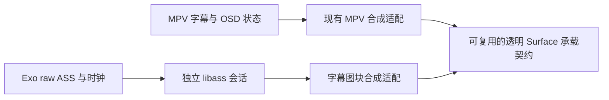
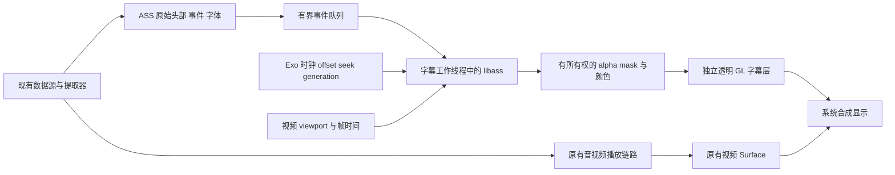

# E4-LIBASS：Exo ASS 特效字幕独立实现研究

## Recovery anchor

- 目标：回答 WebHTV 能否独立接入完整 ASS/SSA 特效渲染，并给出成熟开源参考、推荐设计、可验证边界、分阶段实施与回滚方案。
- 授权：2026-09-14 用户要求跨 Android、桌面播放器、浏览器及其他相关项目深度研究；本轮仅评估，不改生产代码、依赖、补丁或二进制。
- Lane/scope：assessment；仅本文件和 `docs/upstream-player-dependency-merge-assessment-2026-08-20.md`。检索原始证据存放 `/private/tmp/webhtv-libass-research-20260914/`。
- 分支/基线：`feature/mpv-dv7-fel` / `4a447f26e5fa488cb0c1c661398e374b10a56b6e`。
- 保护：开始时仅 `app/.cxx/` 未跟踪，70 个文件由 guard 保护，不纳入本任务。
- 稳定 ID：`E4-LIBASS`；历史 `E4-2` 是 Cue layer/collision/margin 适配，不重编号、不将其冒充 libass 接入。
- 进度：研究与方案比较完成。已核实 Jellyfin Android TV 实际接入 `ass-media` 并选择 `OVERLAY_OPEN_GL`；用户补充现有 MPV 字幕 SurfaceView 后，进一步确认本地已有透明 SurfaceView 和 native EGL/GLES OSD 合成代码。推荐优先复用显示承载契约、评估合成代码抽取，为 Exo 增加独立 libass 输入/时钟适配；未批准任何实施阶段。
- 最便宜的决定性验证：逐项核对原始源码/测试、官方契约、维护者 issue 与独立实现；不把 README 宣传、编译或 MPV 行为当作 WebHTV Exo 的运行证据。
- 时间目标：上海时间 2026-09-14 16:23–16:53；检索 12 分钟、源码/本地链路 8 分钟、综合及核验 10 分钟。16:55 因 GitHub 限流后的证据补读超时，停止扩展检索，剩余契约核对、综合和归档目标 17:07。17:06 起按用户新问题补核 MPV SurfaceView/native OSD 的复用边界，最终归档目标 17:15。
- 网络：系统 HTTP/HTTPS 代理为 `http://127.0.0.1:7897`；后续网络取证显式使用该代理。初次 GitHub 发现查询在代理识别前直连成功，单独记录。
- 回滚：本轮只新增研究文档与索引项；代码基线保持上述提交。
- 当前变更：本研究文档及索引的一行登记；无生产代码修改。文档核验结果与归档提交/tag 由本次 guard 的 `Verification` 和 `Task-Guard: E4-LIBASS-research` 记录定位。
- 未决风险：WebHTV 双 ABI 实机性能、HDR/DV 合成、复杂字体附件及连续 seek 的行为仍需将来经批准的原型验证；未执行构建、安装或性能测试。
- 唯一下一步：归档研究；只有用户明确批准阶段 1 后，才建立原型实施 scope 并开始编码。

## 研究问题与证据标准

1. 是否已有可复用、维护中的 Media3/libass 扩展，而非仅编译脚本或演示？
2. 如何保留 ASS 原始事件、头部、字体附件和时间轴，避免普通 Cue 转换丢失动画/卡拉 OK 信息？
3. 时钟、seek/flush、选轨、暂停/倍速、字体、渲染线程和 Surface 生命周期应如何分工？
4. CPU 位图叠加、GPU 合成、WASM/WebView 或视频烧录各有什么实际限制？
5. 当前 WebHTV 的本地 Media3 补丁、网络/预加载、HDR/DV、双 ABI 与现有字幕行为如何保留？

证据分类：A=源码/测试/官方契约；B=维护者解释或成熟项目实践；C=有方法的独立技术报告；D=单篇帖子或未经复现的经验。论文与宣传性性能数据不会直接转化为本项目性能保证。

## 1. 结论与建议

**可以自行实现，推荐复用成熟的 libass 排版/特效内核，自行完成 Exo 接入和呈现适配。** 不必等待 Media3 官方合并 libass，也不必重新发明 ASS 解释器。

目标是让 Exo 播放时支持字幕组常见的定位、移动、变换、卡拉 OK、描边/阴影/模糊、矢量绘图、裁剪、分层及嵌入字体。这里的“完整特效”以选定 libass 版本及测试语料为基准，不能扩大为全部 VSFilter 历史行为、所有字体格式或所有电视均完全一致。

最直接的开源起点是 **peerless2012/libass-android**；最有价值的实际消费者是 **Jellyfin Android TV**；跨平台设计参照是 **GStreamer、VLC、Kodi、JASSUB**。这组证据能支撑可行性和设计选择，不能代替 WebHTV 的性能及 HDR/DV 实机验收。

建议批准时只先实施阶段 1：默认关闭的外挂 ASS 原型，验证 libass、字体、复用既有承载方式的透明层和播放器时钟。对于视频为 SurfaceView 的路线，优先评估现有字幕 SurfaceView；不因 Jellyfin 使用 TextureView 就默认重新做一套。其余阶段继续留在本任务文档，逐阶段批准，不自动进入 MKV 提取器或生产默认行为修改。

## 2. 当前 WebHTV 的实际基础

| 已有能力与落点 | 对本次设计的约束 |
| --- | --- |
| [ExoUtil.java](../app/src/main/java/com/fongmi/android/tv/player/exo/ExoUtil.java) `setPlayerView`：启用 embedded styles，但关闭 embedded font sizes；已有用户字幕位置/字号设置 | 普通字幕继续沿用原行为；ASS 原样模式必须明确用户字号/位置覆盖规则，不能无条件破坏脚本坐标 |
| 同文件 `buildPlayer`、`buildRenderersFactory`：自定义 `FfmpegRenderersFactory`、软解/硬解选择、音频输出和动态调度 | 只能装饰既有工厂；不能换成扩展示例中的默认播放器工厂 |
| 同文件约 212 行已注册 `PlaybackAnalyticsListener` 为 `VideoFrameMetadataListener`；[PlaybackAnalyticsListener.java](../app/src/main/java/com/fongmi/android/tv/player/exo/PlaybackAnalyticsListener.java) `onVideoFrameAboutToBeRendered` 更新帧率、帧调度/seek 诊断 | 如使用帧时间做字幕同步，应共享分发并保留原监听者；再次直接 `setVideoFrameMetadataListener` 会覆盖既有接线 |
| [MediaSourceFactory.java](../app/src/main/java/com/fongmi/android/tv/player/exo/MediaSourceFactory.java) `createUpstreamDataSourceFactory`、`getExtractorsFactory`、`createMediaSource` | 保留 OkHttp 请求头、EOF 恢复、预加载优先级、缓存、APE、拼接播放及仅加载选中轨道策略；外挂字幕也走现有数据源契约 |
| [DolbyVisionP81ExtractorsFactory.java](../app/src/main/java/com/fongmi/android/tv/player/exo/DolbyVisionP81ExtractorsFactory.java) `wrap`：Matroska raw subtitle、远程 deferred Cues、DV7/P8.1 参数和视频包装 | 直接替换为第三方 `AssMatroskaExtractor` 可能丢失这些参数和后续视频适配；应在现有链路加最小输入钩子 |
| 锁定的 Media3 `SsaParser` 及 `SsaParserTest` 已有样式、位置、layer、重叠与字体样式测试；历史 E4-2 为 layer/collision/margin 适配 | 当前不是“完全不支持 ASS 样式”；缺口是完整运行时特效、字体与帧呈现。不能把 E4-2 重新包装成新任务 |
| MPV 的独立 native 链已经带 libass 与字体库 | 可用作视觉参考；不能从 `libmpv.so` 内部借私有符号/JNI 给 Exo，不能把 MPV 播放成功当作 Exo 验证 |

本地版本依据：[media-lock.json](../third_party/media-lock.json) 的 Media3 `1.11.0-alpha01-fongmi`，源码提交 `e3e922d5c01bc0b564849940fe589daf37360d15`；nextlib `1.10.0-0.12.1-fongmi-softload-av3a-ffmpeg901-r3`，提交 `6ff6cf9d0820382b3c233d018c52e4163b09d345`。本轮通过当前仓库 Git 对象读取了锁定 Media3 的 `NoSampleRenderer`、`SsaParser` 及相关测试。

`/Users/macbookpro/Desktop/github/media` 的当前 checkout 是 `3c2cbe8ac742c2fe15eff52f03eeb3b1b648848d`，不能与锁定产物混为一谈。锁定源码也确认存在 `NoSampleRenderer.onRendererOffsetChanged(offsetUs)` 和 `onPositionReset(...)`；前者契约明确规定从 renderer position 减去 offset 得到媒体位置。实现时仍需对实际依赖进行编译验证。

### 2.1 用户补充：已有 MPV 字幕 SurfaceView 能否给 Exo 复用

**可以复用显示承载和部分合成实现；目前它还不是一个任意播放器可直接调用的完整 ASS 服务。** 初稿只提独立层，没有充分纳入本地已实现的这部分，现修正推荐优先级。

核验到的真实链路：

1. [MpvPlayer.java](../app/src/main/java/androidx/media3/mpvplayer/MpvPlayer.java) 约 2827 行 `createOsdSurfaceView()` 创建普通 `SurfaceView`，设置 `setZOrderMediaOverlay(true)`、`PixelFormat.TRANSLUCENT`、不接收焦点/点击，并放到视频 SurfaceView 的同一父容器。它依赖 `requiresOsdSurface()` 的 direct-output/ISO 条件，并非所有 MPV 输出都走此层。
2. `osdSurfaceCallback`、`reconcileOsdSurface()` 管理尺寸与挂接；[MPVLib.java](../app/src/main/java/is/xyz/mpv/MPVLib.java) 的 `enqueueOsdSurface` 经 [render.cpp](../third_party/mpv-player-jni/src/render.cpp) 和 [request.cpp](../third_party/mpv-player-jni/src/request.cpp) 设置 MPV 的 `android-osd-wid`。JNI 明确要求 MPV 已初始化，没有“提交 ASS_Image 给任意 Surface”的接口。
3. 固定 MPV 源码 `video/out/vo_mediacodec_embed.c` 在 `draw_frame` 用视频 PTS 调 `android_osd_overlay_render`，在 `flip_page` 呈现 OSD；本地另有 optional-OSD/timed-release 补丁，不能把裸源码的前置条件当成当前成品所有行为。
4. `video/out/android_osd_overlay.c` 已实现 `ANativeWindow`、RGBA EGL window surface、GLES2 shader、预乘 alpha 混合、纹理上传、change-id 缓存、清屏与释放。其 `android_osd_overlay_render()` 调用的是 `osd_render(ctx->vo->osd, ...)`，只请求 `SUBBITMAP_BGRA`，然后上传 MPV 打包后的彩色字幕图块。

| 现有部分 | 复用判断 | 必须保留/补上的边界 |
| --- | --- | --- |
| 透明 SurfaceView 创建、层级、尺寸、非交互属性 | 可提取最小通用承载逻辑，Exo/MPV 分别使用 | 生命周期回调应交给当前生产者；避免为 Exo 创建两个重叠字幕层 |
| EGL/GLES 合成、clear、缓存和行拷贝思路 | 有真实复用价值，可评估抽取后重新编译 | 目前依赖 MPV 的 vo/OSD/日志/分配器；拆依赖和许可成本应与采用 libass-android 合成器比较 |
| 字幕图像接口 | 需要适配 | MPV 合成器消费 packed BGRA；libass 输出 mask+color。可先转换有界图块验证正确性，再决定是否保留 BGRA 或改 mask shader；不能把每帧整屏 RGBA 转换当默认 |
| MPV 选轨、字体、ASS 状态与时钟 | 不能直接挂给 Exo 使用 | 属于 MPV 的 demux/OSD 实例；Exo 自己提供 raw events、字体、选轨和媒体时钟 |
| `MpvOsdSurfacePolicy` 与 native 挂接队列 | 借鉴已有回归用例，按内核保留策略 | “当前片首次用过就保留”“先拆 video 再拆 OSD”解决 MPV 特定问题，不宜全量搬进通用宿主 |

`MpvOsdSurfacePolicyTest` 已有选轨、隐藏、首用后保留及 Surface 销毁顺序测试，本轮只读取，未重跑。Surface 归属切换必须先让旧生产者停止并解除连接，再交新生产者；不能让 MPV 和 Exo 的 EGL 同时连接同一个 Surface。复用代码/宿主并不要求跨播放器切换时永远保留同一个 Surface 对象。

推荐的概念分工：

图中两条路径按当前播放器择一连接。最小原型先复用 SurfaceView 的承载契约和必要代码，不为了“完全共享”重构两条 native 播放链；是否把 GLES 部分抽成公共模块，由实际耦合/许可证/性能证据决定。

成熟方案与本地方案的对应：Jellyfin/libass-android 是“Exo 提取输入 + 独立 libass + 独立 EGL/GLES + 透明 TextureView”；现有 MPV direct-output 是“MPV 的字幕/OSD + 独立 EGL/GLES + 透明 SurfaceView”。共同点是字幕单独产生图像并合成，SurfaceView 与 TextureView 只是输出承载的不同选择。

AOSP 文档确认 SurfaceView 可直接作为 EGL/GLES 输出，单独交给 SurfaceFlinger 合成；TextureView 内容先进入应用 UI 合成，更方便 View 变换。额外图层是否使用硬件 overlay 取决于设备，不能保证新增 SurfaceView 总是更快。现有代码仅处理底层视频为 SurfaceView：若 Exo 选择 TextureView，必须另验 Z-order/UI 遮挡，必要时选透明 TextureView 字幕宿主；也不能承诺两个独立 Surface 严格原子同帧呈现。

## 3. 核验过的开源实现与成熟度

### 3.1 首选参考：libass-android 与 Jellyfin Android TV

`peerless2012/libass-android` 不只是 NDK 编译脚本：包含 `ass`、`ass-kt`、`ass-media`，覆盖 JNI、外挂解析、Matroska 字幕/字体、选轨、渲染工厂、Canvas/GL 输出。包装代码是 MIT；其 native CMake 静态链接 libass、FreeType、HarfBuzz、FriBidi、fontconfig、expat、libunibreak 等，依赖许可证需分别处理。

在固定版本 Jellyfin Android TV 中，`ExoPlayerBackend.kt` 实际创建 `AssHandler(AssRenderType.OVERLAY_OPEN_GL)`，在 `enableLibass` 开关下包装 extractor/renderers factory，并把 `AssSubtitleView` 加入字幕视图。版本目录引用 `io.github.peerless2012:ass-media:0.5.1`。这验证了有真实项目接入；未据此推断全部发布版本均默认开启或所有设备均稳定。

扩展提供的模式必须区分：

| 模式 | 实际用途 | WebHTV 决策 |
| --- | --- | --- |
| `CUES` | 向传统 Cue/SubtitleView 输出；项目表格明确不支持动画，也是便捷构建入口的默认值 | 不能用它宣称完成 ASS 特效接入 |
| `EFFECTS_CANVAS` / `EFFECTS_OPEN_GL` | 在 Media3 视频 effects 流程合成，可随视频帧处理 | 会介入视频处理，HDR/DV 及缓冲/时序成本另行验证；本次不优先 |
| `OVERLAY_CANVAS` | 独立视图，可显示动画 | 当前部分工作会阻塞 UI；仅可作为有预算的兼容回退参考 |
| `OVERLAY_OPEN_GL` | 独立渲染线程和透明 TextureView，GPU 合成 mask | 参考其分层方式；本地优先评估复用字幕 SurfaceView，具体见 2.1；不等于 GPU 完成全部 ASS 排版/模糊运算 |

必须改造或核验的具体问题：

1. `render/AssRenderer.kt` 写死 `positionUs - 1000000000000L`。应读取实际 renderer offset，并处理拼接媒体、非零起播和 discontinuity；不能靠调一个固定字幕延迟掩盖。
2. `kt/AssPlayer.kt` 的便捷构建会设置新的 MediaSourceFactory；`withAssMkvSupport()` 会替换 MatroskaExtractor。不能直接覆盖 WebHTV 自定义工厂。
3. `extractor/AssMatroskaExtractor.kt` 反射读取 `extractorOutput`、`subtitleSample`，并按附件长度分配字节数组。对 Media3 版本、混淆和异常附件均敏感；长期适配优先明确的受控源码扩展点。
4. `executor/AssExecutor.kt` 存在 8 ms future 等待路径；异步任务对象和 busy/lastFrame 状态跨线程使用。需要改为清晰的所有权、有界排队和过期结果丢弃。这是源码风险判断，本轮没有复现竞态。
5. 源码默认 glyph cache 为 10000、bitmap cache 为 128 MB、`maxRenderPixels=0`。这不是低内存电视的已验证预算。
6. 已读取的 `lib_ass_media` 单测仍是 `assertEquals(4, 2 + 2)` 模板；不能用“仓库有 tests 目录”证明时钟、生命周期或画质回归覆盖。
7. 维护者/用户记录了 Mali-470 缺少 `GL_EXT_unpack_subimage`、alpha 混合、Android 7 JNI local-reference 溢出、快速移除视图和暂停 resize 问题。部分补丁已合并，但必须核对选定版本；不能把 closed 一律当 merged。
8. #71 的约半秒特效字幕延迟仍为 open 用户报告；#85 压缩 ASS 载荷修复为 closed 但 API 返回 `merged_at=null`。这些是必须纳入语料的风险，不据此声称所有场景都会失败或已修复。

### 3.2 第二参考：LumeraD3v/assrender

有更短的 Media3→libass→Bitmap overlay 实现，包装代码 Apache-2.0，适合理解最小接线。但不建议整包引入：

- 提取器也使用反射；`AssHandler` 使用主线程 Handler、`player.currentPosition` 和约 30 fps 循环，无法直接满足逐帧贴合或重负载要求。
- 实际 `CMakeLists.txt` 编译了 `subtitle_pipeline.c` 与 direct 路径，并链接 avformat/avcodec/avutil/swresample 等 FFmpeg 库。README 的“direct 路径不需要 FFmpeg”不等于当前包没有这些依赖。
- open issue #3 报告旧 Media3 1.5.1 AAR 在 1.9.0 出现 `AbstractMethodError`；open PR #1/#2 涉及默认字体、日志和缺失选轨接线。这些报告不能自动当成主线已修复。
- README 声称 Exo 会移除所有样式，与本地 SsaParser 已有功能不符，未采信该概括。

### 3.3 跨平台参考真正能借什么

| 项目 | 已读的实际实现 | 可借鉴内容与边界 |
| --- | --- | --- |
| GStreamer `assrender` | `gstassrender.c`：视频和字幕 segment 都转为 running time，再喂事件、渲染、合成 | 跨时间域归一化、队列/锁、seek 后 segment 变化；不能照抄其管线 API 到 Exo |
| VLC | `modules/codec/libass.c`：`ass_add_font`、按 PTS/duration 喂 chunk、按呈现时间调用 libass、检查 change 标志 | 字体附件、时间单位、只在必要时重建区域；复制代码前须审核该文件许可证 |
| Kodi | `DVDSubtitlesLibass.cpp`：字体、事件、锁、flush，以及 seek 后重叠事件排序注释 | 把逆向 seek、ReadOrder 和重叠字幕做成真实回归用例；注释不是所有现版本都会错的证明 |
| JASSUB | `JASSUB.cpp`、`worker.ts`、`webgl2-renderer.ts`：libass WASM 在 worker 渲染 mask，GPU 合成 | 分离布局/栅格化与合成、worker 所有权、空帧清屏、预乘 alpha、字体加载；现代 WebGL2/OffscreenCanvas 等要求不适合默认塞入老电视 WebView |
| FFmpeg subtitles filter | `vf_subtitles.c`：按视频帧 PTS 调用 libass，并把 mask 混入 AVFrame | 可用作离线参考画面；烧录必须介入视频帧处理，播放未必需要重新编码，但硬件帧下载/上传与处理成本不能忽略 |

JASSUB 的 `rawRender` 区分“无需更新”的 null 与“需要清空”的空数组，其 worker 执行 GPU 绘制；WebHTV 也必须区分无变化、空画面和失败。只缓存最后一帧会让字幕在结束/关轨后残留。

## 4. 官方提案、文档与论文如何影响决策

Media3 [PR #2324](https://github.com/androidx/media/pull/2324) 是已有 libass 提案，但作者注明不再继续，维护者表示维护成本高、预计不会合并。提案列出仅 MKV、缺外挂、注入点临时、逐帧问题和 4K `draw_ass_rgba` 太慢等缺口。它是很有用的失败边界说明，不是可直接依赖的官方扩展。

[Media3 #2042](https://github.com/androidx/media/issues/2042#issuecomment-2595058592) 的维护者解释：解析发生在提取阶段，此时无法知道稍后的最终视频显示尺寸；需要更晚的自定义字幕显示组件。[#2289](https://github.com/androidx/media/issues/2289#issuecomment-2766645727) 则解释默认文本回调有播放器循环、线程切换和 UI 重绘延迟，并非逐帧呈现系统。后续维护者建议可实验使用 VideoFrameMetadataListener，但未承诺更改普通字幕时间戳语义。因此，单换 SubtitleParser 无法完整解决问题。

Matroska 的 ASS 规范规定：header/styles 在 CodecPrivate；事件 Block 保存 `ReadOrder,Layer,Style,Name,MarginL,MarginR,MarginV,Effect,Text`，时间与持续时长来自容器。外挂完整 ASS 与 MKV chunk 必须采用不同的输入方法，不能从已经扁平化的 Cue 反向恢复。

阅读的图形学论文是 Chris Green（Valve，2007）《Improved Alpha-Tested Magnification for Vector Textures and Special Effects》：SDF 可改善文字/矢量纹理缩放和边缘效果，但不负责 ASS 事件语义、复杂脚本 shaping、字体匹配或播放器同步；文中也讨论单通道距离场的转角问题。**它支持未来局部 GPU 优化的研究方向，不支持本轮重写 SDF ASS 引擎，也不是 Android 性能数据。** 本轮没有获得能直接证明某个 ASS Android 接入方案最优的对照论文，不把不相关论文数量当结论强度。

技术博文 [Text Rendering Hates You](https://faultlore.com/blah/text-hates-you/) 对样式、换行、shaping、字体 fallback、亚像素/透明度及大字形缓存的耦合有具体解释。它进一步支持复用 libass + FreeType/HarfBuzz/FriBidi，而不是在 Java/Canvas 中逐个补标签。博文是工程解释，不是本项目 benchmark。

## 5. 方案比较与明确取舍

| 方案 | 正确性/质量 | 性能与兼容性 | 维护成本 | 决定 |
| --- | --- | --- | --- | --- |
| 不改，沿用 SsaParser/Cue | 保留现有普通字幕；完整动画等缺口仍在 | 无新增 native/GL 成本 | 最低 | 保留为默认及回退基线，不能满足本需求 |
| 原样采用 libass-android 便捷 builder | 内核成熟，但本地工厂、时钟与布局可能错配 | Media3 1.8.0 参考源码与本地 1.11.0 fork 不同；旧 GPU、预算需验证 | 初次接入低，后续隐性成本高 | 拒绝原样套用 |
| **libass + WebHTV 窄适配 + 复用字幕承载层** | 保留 raw ASS/字体，由 libass 解释；自行掌控时钟/生命周期 | 优先复用已有 SurfaceView/EGL 设计；保留视频路径，仍有合成开销和设备风险 | 中等，先复用窄契约，避免整体重构 MPV | **推荐，分阶段原型** |
| 视频 effects 内合成 | 更容易围绕视频帧生成字幕画面 | 介入 video pipeline；HDR/DV、tunneling、附加处理和延迟需单独验证 | 中高 | 独立层达不到明确时序目标时再评估 |
| WebView + JASSUB/WASM | 复用 libass，可参考已有浏览器产品 | WebView/worker/WebGL 版本、JS/JNI 时钟、内存与故障面增加 | 中高 | 借鉴设计，不作为 Android TV 首选 |
| FFmpeg filter 烧录 | 成熟 libass 输出，可生成参考片段 | 改变视频帧处理和硬件路径；可能引入下载/上传，不能宣称零成本 | 高 | 离线对照；不作默认播放架构 |
| 自研 Java/Canvas 或 GPU/SDF ASS 引擎 | 标签组合、shaping、历史兼容需重新验证 | 单项 GPU 优点不等于整体更快 | 最高 | 首轮拒绝 |

不需要让 Exo 通过 MPV 播放视频，也不需要把 libplacebo 作为 ASS 语义引擎；它们可提供合成设计或参照画面，但无法替代原始事件、字体与时钟接入。

## 6. 推荐数据流与关键契约

### 输入与字体

- 外挂完整 ASS：经现有授权数据源读取有界字节，确定编码后交给 `ass_read_memory`/对应完整文件接口。无需把本地 URI 当任意文件路径开放给 native。
- MKV：原始 CodecPrivate 走 `ass_process_codec_private`，每个解压后的完整事件走 `ass_process_chunk`，使用真实 PTS/duration（微秒到毫秒明确转换）。保持 ReadOrder、Layer、Style、覆盖标签及逗号正文；不能同时混用手动 event 修改破坏 libass 的 chunk 去重契约。
- 原始数据钩子应在 Cue 扁平化之前，且在容器 ContentEncodings 正确处理之后。NUL、zlib、buffer offset/limit 都有实际缺陷报告；不把 backing array capacity 当有效样本长度，不靠探测两个 zlib 字节替代完整容器语义。
- 字体附件可能早于或晚于轨道/样式到达。按会话登记、内容哈希去重，字体集变化后触发正确的 font lookup/cache 更新；限制数量、单体/总字节，区分缺字、缺字体和未选中轨道。
- 不把“字体文件名”当唯一字体 family 身份，不假定系统一定有某个字体路径；配置可验证的 fallback，覆盖 CJK、阿拉伯/RTL、组合字符。默认不联网下载字体；新增本地/在线字体来源需单独定义授权、缓存和隐私行为。

### 时间与呈现

- 以 `NoSampleRenderer.onRendererOffsetChanged` 的真实 offset 归一化 `positionUs`；明确 renderer time、period/media time、用户字幕延迟和系统单调时钟的转换。字幕延迟只应用一次，并用可观察用例固定正负语义。
- onPositionReset、媒体切换、选轨、关轨、release 都推进 generation；重建必要事件状态并清除旧帧。外挂完整轨道与流式 MKV 的 seek 策略不同：前者已有完整事件，后者必须保证落点前开始、落点后仍活跃的长事件可以重放。
- `ass_flush_events`/prune 不能机械地在每次 seek 都调用；要与样本重新投递、ReadOrder 去重及回看缓存一起设计。无界保留所有直播事件也不可接受。
- 普通时间同步可用 Exo 媒体时钟驱动；贴画面招牌需要研究 `presentationTimeUs + releaseTimeNs` 的帧调度。复用现有帧监听分发，回调内只发布时间信息；不要同步解析、渲染或等待 native。
- 暂停/缓冲应冻结字幕时间，倍速跟随媒体时钟；暂停时 resize/字体更新仍可重绘。不能把“回调刚发生”当作视频或字幕已经被用户看见。
- 独立 Surface/TextureView 之间并不天然原子呈现。即使取得视频 PTS，也不能承诺字幕与硬件视频扫描输出严格同帧；这一点必须用实际显示结果验证。

### 渲染、线程与资源

- 一个字幕会话拥有 libass library/renderer/track；parse/render/font mutation/release 串行化或使用明确共同锁。JNI/GL/UI 的所有权、销毁顺序和 generation 校验必须写清，不能只依赖 GC/finalize。
- 待渲染时间最多保留最新请求；正在运行的一帧不能靠清空 Java 队列强制中断 native。超时仅丢弃过期结果并禁止继续积压；如一次 native 调用可长时间卡死，进程内 timeout 不能保证安全取消，需作为独立风险处理。
- `ASS_Image` 是按顺序合成的一组 8-bit alpha mask、RGBA 颜色和位置，不是完整 RGBA 视频帧。图像可能宽/高为零，末行只保证 `stride*(h-1)+w` 可读；跨线程输出要复制到有界自有缓冲，或在明确锁定生命周期内完成上传，不能悬挂引用 renderer 管理的内存。
- 合成需正确处理 ASS 颜色低字节的透明度约定、mask coverage、预乘 alpha 和图层顺序。不能给已预乘结果再乘一次 alpha；色彩矩阵与 HDR 字幕亮度另测。
- 使用 `detect_change` 区分位置/内容变化，静态字幕不重复上传；空帧、关轨和 Surface 重建均要正确清屏。
- GLES2/旧 Mali 不保证 `GL_EXT_unpack_subimage`；可使用有界紧密行拷贝/可用上传路径，并测试 alpha bitmap 回退。不能仅因主流手机支持某扩展就调用它。
- 用真实显示 viewport 对齐脚本坐标，包括 PlayRes、视频 storage size、SAR/DAR、黑边、缩放裁切、旋转和 UI 布局。ASS 原样模式中强制居中或一刀切缩放字号都会改变特效。
- 普通 Cue 仍交给原 SubtitleView。只有当前已成功接管的 ASS 轨道隐藏其重复文字；不能隐藏整个包含字幕/交互的容器而让 SRT、图形字幕或控件失效。

## 7. 性能预算：目前是设计目标，不是测试结果

独立字幕层能减少对既有视频管线的侵入，但 libass 的 shaping、栅格化、复杂 blur/clip 和大量事件仍消耗 CPU，上传/合成仍消耗 GPU 与内存。复杂脚本没有“任意设备全速”的保证。

一个 3840×2160 RGBA 画面约 31.6 MiB，双缓冲约 63.3 MiB，尚未计 native mask、glyph cache、GL texture 和上传暂存。60 fps 每次搬运整帧的理论像素字节量约 1.99 GB/s（十进制），不等于实测带宽，但足以说明默认整屏 Bitmap 路线不合适。

阶段 1 可从以下**待测起始配置**比较，不直接写成产品默认：

| 项目 | 原型预算/衡量方式 |
| --- | --- |
| 缓存 | 试验 32 MiB libass bitmap cache；字体附件总额可先限 32 MiB/单体 8 MiB；测 CJK 与多字体语料后调整，记录拒绝原因 |
| 分辨率 | 同时比较原分辨率与显式 1080p 上限；降采样会影响精细描边和招牌，不能在“原样”模式悄悄降低质量 |
| 调度 | 最多 1 个在途渲染和 1 个最新请求；更新频率受显示刷新率约束，静态内容按 change 标志复用 |
| 时延 | 记录字幕排版/render/upload/swap 的 p50/p95/max、超期帧和 queue age；目标是正常语料工作 p95 小于一个显示刷新周期，复杂语料单列 |
| 播放影响 | 同设备、同文件、同播放设置对照关闭/开启 ASS，比较首开、seek、视频丢帧、音频 underrun、PSS/native/GL 内存与热状态 |
| 生命周期 | 连续 seek/换轨/换集后内存应进入有界平台，不随操作持续增长；缓存可保留，泄漏不可用“有缓存”解释 |

选择一个 64 位设备和一个代表性的 32 位/旧 GLES2 电视覆盖 ABI 与 GPU 差异；阶段 1 先验证一个可用 ABI。性能差异需要稳定配对样本和多次短测，不能用一次均值保证无回归。没有达到预算时，应明确拒绝该语料的特效模式或让用户选择降级，不能拖垮音视频后继续显示“正常”。

## 8. 最小分阶段实施与回滚

以下为研究提出的实施单元，**全部尚未获实施授权**。每阶段继续使用本任务唯一文档；开始时根据工具链、缓存、可用设备和 ABI 重新给出当前代理的实际墙钟估算，本轮不报人天或未经构建验证的工期。

| 阶段 | 独立交付 | 最便宜的决定性验证 | 回滚 |
| --- | --- | --- | --- |
| 1：外挂 ASS 原型 | 默认关闭；固定 libass/依赖来源；一个 ABI；外部 ASS、fallback 字体、正确时钟；优先复用现有 SurfaceView 承载契约并接独立 GL 生产者；关轨/release | 固定时间点图像与同版本 libass 比较；动画/暂停/seek；与关闭字幕的播放基线配对；若提取共享宿主则运行已有相关 MPV 策略测试 | 关闭会话开关，回到既有 SsaParser/Cue；原型提交独立可回退 |
| 2：MKV 与字体 | 在当前提取器体系补最小 raw ASS/附件接口，保留 DV/seek/网络行为；字节限制、选轨、ReadOrder 与长事件重放 | CodecPrivate/chunk 原始字节契约测试；字体前后到达；NUL/压缩/乱序与长字幕 seek 用例 | 撤回该输入适配；外挂原型可独立保留 |
| 3：电视兼容与性能 | 双 ABI、旧 GPU fallback、4K/HDR/DV、Surface 切换、同步与资源预算 | 两类代表设备、目标媒体配对测试；真实显示对齐；新 native 包 ABI/16 KiB page/依赖符号检查 | 按设备/会话停用新字幕层；必要时原子回退同阶段二进制与锁 |
| 4：产品化 | 清晰的 ASS 原样/兼容选择、异常回退、诊断导出、可灰度开关；完善字幕偏好规则 | 字幕与现有播放设置回归、恢复流程、素材质量报告；用户可见结果验收 | 关闭新功能并保留旧设置/旧路径；不能静默切 MPV 或改变解码器 |

依赖源码、NDK、构建参数、每 ABI `.so`/AAR SHA-256 与许可证必须随实现锁定。本轮下载的研究源码不是已批准的生产依赖；不修改 MPV/FFmpeg/libplacebo 锁来“顺便升级”。

## 9. 验收清单与故障证据

| 场景 | 必须证明的行为 |
| --- | --- |
| A01 外挂基本 ASS/SSA | 样式、位置、字体和时间与固定 libass 参考一致；编码边界清晰 |
| A02 动态标签 | `move`、`t`、淡入淡出、旋转/缩放、karaoke 在中间时间点仍正确，不能只拍起止帧 |
| A03 绘图/剪裁/混合 | `p`、`clip/iclip`、blur、outline/shadow、多层和重叠 alpha 正确 |
| A04 字体 | MKV 多字体、缺字体 fallback、CJK、RTL、组合字符；字体早/晚到达皆可解释 |
| A05 MKV 字节与时间 | header、ReadOrder、Layer、逗号正文、offset/length、PTS/duration 保真；压缩遵守容器语义 |
| A06 异常输入 | NUL、无效/巨大附件、截断、无效时间、极端标签有界处理，有原因日志且不拖垮播放 |
| A07 非零起播/拼接 | 正确使用 stream/period offset；连续换集、拼接媒体无固定偏移错误 |
| A08 seek | 前后 seek、连续 seek、落在长事件中间、不重新读到旧 block 的回看场景无漏字/重复/旧帧 |
| A09 暂停/缓冲/倍速 | 字幕媒体时间正确冻结/推进；暂停时 resize、字体完成加载仍能重绘 |
| A10 轨道切换与关闭 | ASS↔SRT/WebVTT/图形字幕、关字幕、双语言轨道选择无双重渲染或残留 |
| A11 显示几何 | 黑边、非方形像素、裁剪/缩放、窗口变化、电视 overscan 布局下字幕映射正确 |
| A12 生命周期 | 快速 add/remove、Surface 重建、后台/前台、释放期间回调不访问已销毁 native/GL 对象 |
| A13 旧 GPU / ABI | armeabi-v7a 与 arm64-v8a；缺少 row-length 扩展的 GLES2 上传路径和输出正确 |
| A14 SDR/HDR/DV | 视频颜色/模式无意外变化，字幕亮度与 alpha 合理；分别覆盖既有 Surface/TextureView 与受支持播放路径 |
| A15 负载 | 4K 大招牌、模糊、多事件和长时播放有界；对照视频丢帧/音频 underrun 和热状态 |
| A16 呈现时间 | 普通字幕统计延迟/抖动；贴画面招牌对照视频帧和实际屏幕，单独报告不能做到严格同帧的设备 |
| A17 回退 | 选中 ASS 但初始化/字体/GL 失败时明确回退原因；不自动换播放器或悄悄关闭当前音视频能力 |
| A18 无字幕及普通字幕 | 功能关闭时无 native/GL 常驻成本；现有字幕字号/位置、网络、选轨、DV、软硬解和诊断链不回归 |

画质比较必须固定 libass 版本、字体文件、字体解析日志、脚本/样本、播放时间及 viewport；只拿不明字体配置的 MPV 截图作“正确答案”会误判。可用离线 FFmpeg/libass 生成参考，差异需要区分文字排版、栅格化、色彩和实际呈现时刻。

建议诊断至少记录 session/track/generation、输入字节/事件/字体计数、实际 font family、媒体时间和 offset、renderer size/viewport、render 耗时、mask 数/面积、upload 字节、清屏/过期丢弃/回退原因。字体名、媒体 URI 等按现有日志策略脱敏，不导出完整字幕正文或凭据。

“已解析”“产生 mask”“GL swap 已提交”“视频帧回调”都是分层证据，不等于用户实际看到了字幕。故障报告要指出最后正常层、缺失证据与最小验证步骤，例如在同时间点捕获独立字幕层与屏幕结果。受保护 Surface 或 HDR 屏幕录制可能改变/隐藏输出，必要时采用外部拍屏，不用录屏成功代替真实显示验证。

## 10. 来源、固定版本与证据等级

访问日期均为 **2026-09-14（Asia/Shanghai）**。源码是读取实现，不是运行验证；issue 是作者/维护者报告，不是本项目复现。官方规格记 A，源码本身记 A（只能证明实现方式），维护者解释/产品实践记 B，技术论文或工程博文按其可支持的范围记 C，未经独立复现的单条问题/宣传记 D。

### 固定源码清单

| 来源 | 完整 revision | 本轮处置 |
| --- | --- | --- |
| [peerless2012/libass-android](https://github.com/peerless2012/libass-android/tree/04dcc7d49cfe35076fce5eea81c5918f381caa47) | `04dcc7d49cfe35076fce5eea81c5918f381caa47` | 候选参考；优先适配，不原样集成 |
| [Jellyfin Android TV](https://github.com/jellyfin/jellyfin-androidtv/tree/3d087faa00e79044016b14f8b227affe5942af7e) | `3d087faa00e79044016b14f8b227affe5942af7e` | 实际消费者参考；未移植 |
| [LumeraD3v/assrender](https://github.com/LumeraD3v/assrender/tree/3542e5a2f099664d47832d03043bd499c1504a1a) | `3542e5a2f099664d47832d03043bd499c1504a1a` | 最小结构参考；不建议整包采用 |
| [libass](https://github.com/libass/libass/tree/b2fe9d8770678a7b5271387d38c20657ebf3429a) | `b2fe9d8770678a7b5271387d38c20657ebf3429a` | API/许可参考；生产选版待阶段 1 决策 |
| [JASSUB](https://github.com/ThaUnknown/jassub/tree/656371af1c904be59a1008dcdb93f18dfe5e23d0) | `656371af1c904be59a1008dcdb93f18dfe5e23d0` | worker/GPU 设计参考；不引入 WASM |
| [GStreamer](https://github.com/GStreamer/gstreamer/tree/bb387b3c7bea6d275d20b13af8c622bd465f7c69) | `bb387b3c7bea6d275d20b13af8c622bd465f7c69` | segment/同步/合成参考 |
| [VLC](https://github.com/videolan/vlc/tree/c666634229ca28354fd4fc1bdf8c43a8a232644b) | `c666634229ca28354fd4fc1bdf8c43a8a232644b` | 时间/字体/区域缓存参考 |
| [Kodi](https://github.com/xbmc/xbmc/tree/334195075cd7183f6787aecd6a74ea377dd8f731) | `334195075cd7183f6787aecd6a74ea377dd8f731` | seek/锁/事件参考 |
| [本地锁定的 FongMi/mpv](https://github.com/FongMi/mpv/tree/cca559b41ceb0bb7731cf6ef2e1f33276cd30c42) | `cca559b41ceb0bb7731cf6ef2e1f33276cd30c42` | 已有 OSD Surface/EGL 复用评估；不修改原 MPV native 链 |
| 本地 `/Users/macbookpro/Desktop/github/FFmpeg` | `85c0e1a333444cfe2f5491a0c4262bbc7c92f719` | 只读 `libavfilter/vf_subtitles.c`；不视为本地已发布依赖版本 |
| 本仓库锁定的 Media3 源码 | `e3e922d5c01bc0b564849940fe589daf37360d15` | 本地契约；保留且不升级 |
| 本仓库锁定的 nextlib | `6ff6cf9d0820382b3c233d018c52e4163b09d345` | 依赖边界；本轮无新修改候选 |
| 现有 MPV 锁定 libass | `89cc0f4e450d64f74281a17d7f11ed05229665e8` | 已有另一条二进制链；不与 Exo 研究版本混同 |

以上是本轮固定证据版本清单，不是要求合并的 commit range。没有选择上游历史提交批次，因而不重做既有全量上游 ledger。各行处置均为参考/保留/候选，未执行 cherry-pick 或依赖更新。

### 可追溯证据表

下表的文件路径位于上表对应固定 revision；issue/PR 与网页为访问日快照，无不可变版本号。

| ID / 来源 | 等级与支持的判断 | 对 WebHTV 的适用性、限制与决策影响 |
| --- | --- | --- |
| S01 [libass `ass.h`](https://github.com/libass/libass/blob/b2fe9d8770678a7b5271387d38c20657ebf3429a/libass/ass.h)，已读 ASS_Image、render、chunk、ReadOrder、prune、font API | A：输入/时间单位、alpha mask/stride、变化提示与事件契约 | 直接决定 JNI、队列、缓存和渲染边界；API 存在不等于性能已测 |
| S02 [Matroska SSA/ASS](https://www.matroska.org/technical/subtitles.html#ssaass-subtitles) | A：CodecPrivate、Block 字段、容器时间与 ReadOrder | 决定 raw 输入；不可从 Cue 复原完整脚本 |
| S03 [Aegisub ASS 标签文档](https://aegisub.org/docs/latest/ass_tags/) | A：move/transform/karaoke/drawing/clip 等语义说明 | 作为语料设计依据；实际兼容仍以选定 libass 与样本为准 |
| S04 [Media3 支持格式](https://developer.android.com/media/media3/exoplayer/supported-formats) + 锁定 SsaParser/测试 | A：支持 SSA/ASS 容器/解析以及部分样式 | 不将“支持格式”推断为完整特效；保留已有测试和功能 |
| S05 [Media3 #2324](https://github.com/androidx/media/pull/2324)，[维护者结论](https://github.com/androidx/media/pull/2324#issuecomment-2828026034) | B：作者停止工作、维护成本、提案缺口 | 不等待其合并，不当成熟官方模块 |
| S06 [Media3 #2042](https://github.com/androidx/media/issues/2042#issuecomment-2595058592) | B：解析时无法获得最终显示尺寸 | 解析和显示拆分；自定义显示层 |
| S07 [Media3 #2289](https://github.com/androidx/media/issues/2289#issuecomment-2766645727)，[帧监听建议](https://github.com/androidx/media/issues/2289#issuecomment-2775666590) | B：普通文本路径不保证逐帧精度；帧时间可供实验 | 单独验收呈现延迟；保护现有视频帧监听 |
| S08 [Media3 #2383](https://github.com/androidx/media/issues/2383#issuecomment-2872355740)，[补充说明](https://github.com/androidx/media/issues/2383#issuecomment-2886390997) | B：TextOverlay 与 Bitmap/CanvasOverlay 的 HDR 亮度/API 处理存在差异 | 这是当时 effects 路径讨论，不推断目前所有版本或独立 Android View 都存在相同限制；HDR/DV 仍须实测 |
| S09 [libass-android `lib_ass_media`](https://github.com/peerless2012/libass-android/tree/04dcc7d49cfe35076fce5eea81c5918f381caa47/lib_ass_media) | A：已读 AssPlayer、AssRenderer、AssExecutor/Task、AssHandler、AssTrackOutput、AssMatroskaExtractor、ParserFactory、配置和模板测试 | 最直接可复用结构；固定偏移、反射、工厂替换、预算是明确适配点；README 的速度/内存宣传未复现 |
| S10 [Jellyfin `ExoPlayerBackend.kt`](https://github.com/jellyfin/jellyfin-androidtv/blob/3d087faa00e79044016b14f8b227affe5942af7e/playback/media3/exoplayer/src/main/kotlin/ExoPlayerBackend.kt) 与版本目录 | A/B：实际选择独立 OpenGL overlay，依赖 ass-media 0.5.1 | 提升集成可行性的可信度；不证明 WebHTV 可原封不动复用 |
| S11 libass-android [#70](https://github.com/peerless2012/libass-android/pull/70)、[#76](https://github.com/peerless2012/libass-android/pull/76)、[#79](https://github.com/peerless2012/libass-android/pull/79)、[#80](https://github.com/peerless2012/libass-android/pull/80)、[#82](https://github.com/peerless2012/libass-android/pull/82)、[#87](https://github.com/peerless2012/libass-android/pull/87) | B：已合并的生命周期/混合/老 GPU/JNI/resize 修复记录 | 转成回归清单；本轮没有重演报告设备的故障 |
| S12 libass-android [#55](https://github.com/peerless2012/libass-android/issues/55)、[#71](https://github.com/peerless2012/libass-android/issues/71)、[#85](https://github.com/peerless2012/libass-android/pull/85) | D：NUL、延迟、压缩事件的具体报告；#85 closed 且未合并 | 输入与时间边界仍需语料验证；不把报告当统一根因或修复证明 |
| S13 [assrender 源码](https://github.com/LumeraD3v/assrender/tree/3542e5a2f099664d47832d03043bd499c1504a1a/assrender/src/main)，[#1](https://github.com/LumeraD3v/assrender/pull/1)、[#2](https://github.com/LumeraD3v/assrender/pull/2)、[#3](https://github.com/LumeraD3v/assrender/issues/3) | A/D：实际 CMake、反射和 render loop；字体/选轨/AAR 问题报告 | 仅取窄参考，不能把 open PR 当已解决或把 README 当包依赖清单 |
| S14 [GStreamer `gstassrender.c`](https://github.com/GStreamer/gstreamer/blob/bb387b3c7bea6d275d20b13af8c622bd465f7c69/subprojects/gst-plugins-bad/ext/assrender/gstassrender.c)，[插件文档](https://gstreamer.freedesktop.org/documentation/assrender/index.html) | A/B：segment running time、事件队列和合成 | 借鉴不同时间域转换与锁；非 Exo 现成适配 |
| S15 [VLC `libass.c`](https://github.com/videolan/vlc/blob/c666634229ca28354fd4fc1bdf8c43a8a232644b/modules/codec/libass.c) | A/B：字体、PTS/duration、change-aware 重绘 | 稳定的职责划分参考；复制需逐文件许可证审查 |
| S16 [Kodi `DVDSubtitlesLibass.cpp`](https://github.com/xbmc/xbmc/blob/334195075cd7183f6787aecd6a74ea377dd8f731/xbmc/cores/VideoPlayer/DVDSubtitles/DVDSubtitlesLibass.cpp) | A/B：字体/事件/锁/flush，seek 顺序注意事项 | 决定 seek 回归语料；不因 GPL 项目可读就视为可无条件复制 |
| S17 [JASSUB 源码](https://github.com/ThaUnknown/jassub/tree/656371af1c904be59a1008dcdb93f18dfe5e23d0/src) 与 README | A/B：WASM libass、worker、GPU mask 合成、预乘 alpha、现代浏览器要求 | 借鉴线程/数据所有权与合成；“快于 native”等宣传未用作实测证据 |
| S18 [Green 2007 论文原文](https://cdn.akamai.steamstatic.com/apps/valve/2007/SIGGRAPH2007_AlphaTestedMagnification.pdf)，已读 5 页 | C：SDF 字形/矢量纹理放大及限制 | 只影响远期局部优化选择；不证明完整 ASS 引擎或 Android 播放性能 |
| S19 [Text Rendering Hates You](https://faultlore.com/blah/text-hates-you/)，已读 shaping/fallback、透明合成与大字形部分 | C：文字处理的实际复杂性 | 支持复用成熟文字栈；不是 ASS 标准或性能 benchmark |
| S20 本地固定 FFmpeg `libavfilter/vf_subtitles.c`，`filter_frame` / `overlay_ass_image` | A：按视频 PTS 调 libass 后混入 AVFrame | 离线参考与 burn-in 代价判断；未构建或烧录测试 |
| S21 本地 `MpvPlayer.createOsdSurfaceView`、JNI `enqueueOsdSurface`、`MpvOsdSurfacePolicyTest`；[固定 native OSD 实现](https://github.com/FongMi/mpv/blob/cca559b41ceb0bb7731cf6ef2e1f33276cd30c42/video/out/android_osd_overlay.c) 与 `vo_mediacodec_embed.c` | A：已有透明 SurfaceView、独立 EGL/GLES、BGRA 图块和 MPV OSD 耦合 | 改变本地实施优先级为复用承载/评估合成抽取；不把已有层等同于通用 ASS 服务 |
| S22 AOSP [SurfaceView/GLSurfaceView](https://source.android.com/docs/core/graphics/arch-sv-glsv)、[TextureView](https://source.android.com/docs/core/graphics/arch-tv) | A：两类宿主的合成与生命周期机制，SurfaceView 可接 EGL | 支持原型优先使用已有 SurfaceView 设计；Z-order、硬件 overlay 数量和实际收益仍需设备验证 |

证据类覆盖：官方规格/API、确切源码/现有测试、PR/issue/维护者讨论、成熟相关项目、技术论文/博文/现场报告均已覆盖。本任务不是挑选具体上游 revert，未发现需要把某个 revert 作为方案前提；也未把尚未阅读正文的搜索结果、HN 模糊匹配或 404 的 libass wiki 页面列为证据。

## 11. 许可证、来源与可复现边界

- libass 主库 ISC 不等于整个字幕包都是 ISC。FreeType、HarfBuzz、FriBidi、fontconfig 等需要逐项记录许可证与版本，确认 LGPL 相关发布义务和静态链接策略。
- libass-android 包装 MIT、assrender 包装 Apache-2.0；JASSUB 顶层 LICENSE 为 MIT，而 package 元数据明确列出 WASM/native 依赖的多种许可证。VLC/Kodi 优先借设计和语料思路，复制文件前审核其具体许可。
- 不复用不明来源 prebuilt，不让 Exo 新库意外解析到 MPV/FFmpeg 的同名依赖符号；新 JNI 库名称、导出可见性、C++ runtime、ABI 与 16 KiB page 支持属于阶段 3 包装验收。
- 下载归档只用于阅读，没有执行外部项目脚本或 native 文件。代理取证使用 `http://127.0.0.1:7897`。匿名 API 限流后，经用户授权的认证只用于 GitHub GET；凭据未写入仓库/证据文件，认证进程已退出。
- 三份源码归档 SHA-256：peerless `538984edf6480bef0c7605292e913f39e96d967ad69fc8802e5aad05c7c5f490`；assrender `918fefb558c4acf48ee271ac34beb7897e4cfb7c9df9890f4d718aba8c388532`；JASSUB `fe101651b866f746c799fe9820ea8def46bfd4a8e5ffc6ba5155eb547904cbfa`。原始快照位于 Recovery anchor 的临时目录；长期依据是本文件的固定 commit URL 与访问日期。

## 12. 本轮完成边界

已完成可行性判断、跨平台来源核对、本地调用链分析、候选方案比较、分阶段验收和回滚设计。文档归档进行一次范围内的结构、链接、完整 revision 与保密边界核验，结果记录于归档提交的 `Verification` 字段；guard 同时检查保护路径与原子提交/tag。

本轮没有构建 APK/AAR/so，没有安装设备，没有运行上述 A01–A18，也没有测得 WebHTV 性能改善。推荐是“实施可回退原型并按证据扩大”，不是“已实现”或“所有电视验证通过”。首次归档提交可用 `Task-Guard: E4-LIBASS-research` 定位，其本地恢复 tag 使用 `recovery/E4-LIBASS-research/` 前缀；不推送远端。
